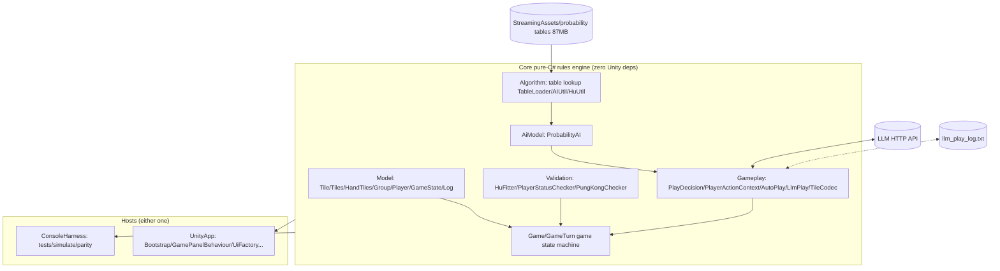
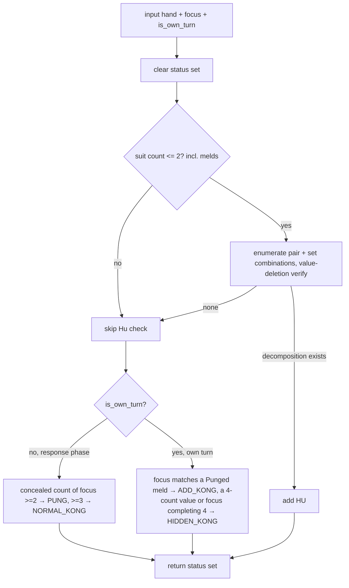
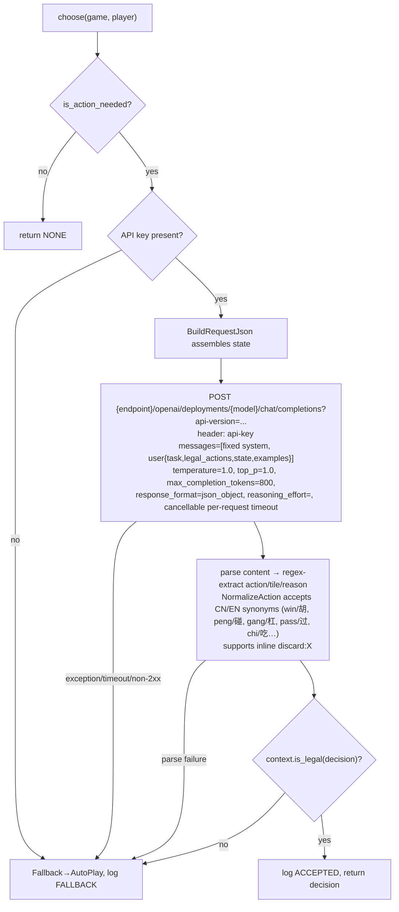

# Sichuan Mahjong Module Functional Requirements (for AI coding agents)

> Version: v1.1 (2026-07-10)
> v1.1 revision: following interface-documentation conventions (IEEE 29148 / standard API-reference fields), every function in every module now specifies **purpose, parameters, return value, error & edge-case behavior, and side effects**; each module gains a "Source reference" subsection (original classes/methods → file:line); new §2.4 key-class & enum quick reference; **three important semantics corrected against the code** — ① the actual implementation of Seven Pairs / Dragon Seven Pairs (the previous description was wrong, see M2); ② the Added-Kong status only triggers on the just-drawn tile; ③ the probability AI's tenpai branch is unreachable at runtime because the win tables are never loaded (see M3).
> Purpose: every standalone module spec can be **handed directly to Codex / Claude Code for independent implementation and testing** (C#/.NET 8 or Python recommended; none require Unity).
> Companion document: `SichuanMahjong_PRD.md` / `SichuanMahjong_PRD_EN.md` (the PRD stays at the feature level — what/why; this document is authoritative for function-level contracts)

---

## 1. Game Introduction

Four-player Sichuan Mahjong: Bamboo (B) / Character (C) / Dot (D), 3 suits × 1–9 × 4 = 108 tiles, no honor tiles. Each player gets 13 tiles; a random dealer gets 14 and moves first. Players take turns drawing and discarding; other players may respond to a discard with Hu (win) / Pung / Kong, and on one's own turn a concealed or added Kong is possible. Winning requires "missing one suit" (hand contains ≤2 suits); win types are the standard win (4 sets + 1 pair) and Seven Pairs (a Dragon-Seven-Pairs branch exists in code but is unreachable — see M2); the game ends as soon as any player wins (no Blood Battle, no scoring yet). The human seat supports three decision sources: Manual / probabilistic-AI piloting (Auto Play) / large-model piloting (LLM Play), all sharing the same rules engine.

**Architectural trait**: the rules engine (Core) is pure C# with zero Unity dependencies (asmdef enforces `noEngineReferences:true`); Unity is presentation-only. A .NET 8 headless console (ConsoleHarness) supports batch self-play and parity verification. **All modules in this document come from Core / Tools and are inherently standalone.**

## 2. Overall Architecture & Module Breakdown

### 2.1 Architecture Diagram



### 2.2 Module List, Breakdown & Standalone Verdicts

| Module | Submodules | Key files (under `Assets/Scripts/`) | Standalone |
|---|---|---|---|
| A Domain model | Tile / tile sets / hand / melds / player / snapshot / log; the three tile encodings | `Core/Model/*`, `Core/Gameplay/TileCodec.cs` | ✅ |
| B Game state machine | Wall building & dealing / turn advancement / response arbitration / branch handlers (Hu/Pung/Kong/Skip) / game end | `Core/Game/Game.cs`, `GameTurn.cs` | ✅ (further splittable: state machine / prompt text / GameState projection) |
| C Rule validation | Win-hand decomposition (standard / Seven Pairs) / missing-one-suit / Pung-Kong feasibility / combination generator | `Core/Validation/*`, `Core/Utils/Utils.cs` | ✅ |
| D Table-lookup algorithms | Table loading / integer tile codes / tenpai-win queries / discard & Pung/Kong scoring | `Core/Algorithm/*` | ✅ (splittable: loading layer vs. decision layer) |
| E Probabilistic AI | IAI interface + ProbabilityAI bridge | `Core/AiModel/*` | ✅ |
| F Decision & legality | PlayDecision value object / legal-action-set generation / legality validation | `Core/Gameplay/{PlayDecision,PlayerActionContext}.cs` | ✅ |
| G Controllers | AutoPlayController / LlmPlayController (HTTP + logging) | `Core/Gameplay/*Controller.cs` | ✅ |
| H Headless simulator | The three commands tests / simulate / parity | `Tools/ConsoleHarness/Program.cs` | ✅ |
| I Unity presentation layer | Bootstrap / main-loop scheduling / UI factory / tile views / winning-hand display / rewards | `UnityApp/*` | ❌ (out of scope for this document) |

### 2.3 Module × Creative / Layout / Assets / Gameplay / Logging Map

| Dimension | Corresponding modules |
|---|---|
| Creative / rules | B state machine (first-win-ends / kong chains), C validation (missing-one-suit / Seven Pairs), the three-mode design (GAME_MODES) |
| Layout | I: `Config.cs` (1920×960 logical coordinates), `UiFactory` (Swing-coordinate-style uGUI generation), the `Draw*` methods in `GamePanelBehaviour` |
| Assets | `StreamingAssets/img/{Bamboo,Character,Dot}/0N.png` tile faces, background, 50-frame reward animation, `sound/slot_win_01.wav`, the probability tables |
| Gameplay | E probabilistic AI, F legality, G controllers, I's 3-second scheduling and hotkeys |
| Logging | `Core/Model/Log.cs` (in-memory scrolling UI log), G's `llm_play_log.txt`, the CoreEnv.Println hook |

### 2.4 Key-Class & Enum Quick Reference (all of Core)

| Class / enum | File | Role (one sentence) |
|---|---|---|
| `Tile` | `Core/Model/Tile.cs` | One tile: value equality on `(type, number)` (`Equals` ignores index); `ToString()` is the wire code `"C7"` |
| `Tiles` | `Core/Model/Tiles.cs` | Ordered tile-collection base: sorts by suit (B<C<D) then number; `Remove` deletes the first value match and re-sorts |
| `HandTiles : Tiles` | `Core/Model/HandTiles.cs` | The hand: concealed tiles + a separately held `newTile` + declared Pung/Kong melds; mutators for draw/discard/Pung/the three Kongs |
| `Group : Tiles` | `Core/Model/Group.cs` | Categorized tile group (sequence/triple/pair/pung/kong); `GetDup()` mints a "non-equal duplicate" via an auto-incremented identification |
| `Player` | `Core/Model/Player.cs` | A seat: hand + discard table + status flag-set; `Plays` discards (falls back, then throws if the tile is unavailable); identity = name |
| `AI1/AI2/AI3 : Player` | `Core/Model/AI{1,2,3}.cs` | The three bot seats (byte-identical duplicated code): `PlayAction` auto-discards, `OtherAction` chooses a claim response |
| `GameState` | `Core/Model/GameState.cs` | Read-only human-perspective snapshot; `GetPlayerHand()` returns a copy including newTile |
| `Log` | `Core/Model/Log.cs` | Timestamped in-memory event log; `GetLastXMessages(x)` returns the last x entries (for the UI) |
| `TileCodec` | `Core/Gameplay/TileCodec.cs` | `"C7"` ⇄ Tile codec + Chinese display (B1 → "幺鸡") |
| `TileTypeEnum` | `Core/Model/TileTypeEnum.cs` | `{B, C, D}` = Bamboo/Character/Dot; **declaration order is the sort order** |
| `GroupEnum` | `Core/Model/GroupEnum.cs` | `{SEQUENCE, TRIPLE, PAIR, PUNG, NORMAL_KONG, ADD_KONG, HIDDEN_KONG}` |
| `PlayerStatusEnum` | `Core/Model/PlayerStatusEnum.cs` | `{HU, CHOW, PUNG, HIDDEN_KONG, ADD_KONG, NORMAL_KONG, WIN, WAITING, PLAYING}` (a set, not exclusive; WIN is never used by the engine) |
| `PlayerActionEnum` | `Core/Model/PlayerActionEnum.cs` | AI response enum `{HU, CHOW, PUNG, KONG, SKIP}` |
| `HuFitter` / `PlayerStatusChecker` / `PungKongChecker` | `Core/Validation/*` | Win-decomposition enumeration / status computation (side-effecting constructor) / Pung-Kong predicates |
| `Utils.GetCombinations` | `Core/Utils/Utils.cs` | n-combination generator (deliberately preserves Java Set semantics; HuFitter depends on it) |
| `MaJiangDef` / `TableLoader` / `AITable*` / `HuTable*` / `AIUtil` / `HuUtil` | `Core/Algorithm/*` | Runtime subset of esrrhs/majiang_algorithm: card-code constants / table parsing / the three AI probability tables / the three win tables (never loaded) / discard & claim scoring / win-tenpai queries |
| `IAI` / `ProbabilityAI` | `Core/AiModel/*` | AI strategy interface / domain-object→integer-code bridge implementation |
| `PlayDecision` / `PlayerActionContext` | `Core/Gameplay/*` | Decision value object / the legal-action source of truth |
| `IPlayController` / `AutoPlayController` / `LlmPlayController` | `Core/Gameplay/*` | Human-seat controller abstraction / probabilistic-AI pilot / LLM pilot (HTTP + logging + fallback) |
| `WinningHandArranger` | `Core/Gameplay/WinningHandArranger.cs` | Display arrangement of the winner's concealed tiles (backtracking decomposition, for the winning-hand dialog) |
| `Game` / `GameTurn` | `Core/Game/*` | Game state machine / 4-seat rotation queue |
| `CoreEnv` | `Core/CoreEnv.cs` | Host side-effect hooks: `Beep`, `Println` (no-op defaults; Unity→Debug.Log, headless→Console) |

---

## 3. Standalone Module Functional Specifications

Shared conventions: tile transport code `"<B|C|D><1-9>"` (B=Bamboo, C=Character, D=Dot; e.g. `C7` = 7 of Characters); seat 0 = human (YOU), seats 1..3 = AIs. Every interface is specified with the five fields **purpose / parameters / return / errors & edge cases / side effects** (side effects omitted for pure functions).

---

### Module M1: Tile Domain & Codec

**Function**: define tiles, tile collections, the hand (including Pung/Kong melds), and conversions among the three encodings. The foundation for all other modules.

**Data structures**:

```
TileType ∈ {B, C, D}                     // sort order B < C < D (enum declaration order)
Tile { type: TileType, number: 1..9 }    // value-equality semantics (type+number), index ignored
Group { tiles: Tile[], category: SEQUENCE|TRIPLE|PAIR|PUNG|NORMAL_KONG|ADD_KONG|HIDDEN_KONG }
HandTiles {
  tiles: Tile[]         // concealed hand (sorted: suit first, then number)
  newTile: Tile?        // the just-drawn tile kept separate, not merged into tiles; merged views used for discarding/validation
  melds: Group[]        // exposed Pungs/Kongs (the original keeps separate pung/kong lists)
}
```

**Interface details**:

`code(tile: Tile) -> str`
- **Purpose**: tile → transport code, i.e. `enum name + digit` (`"C7"`).
- **Returns**: string; a null tile → empty string (original semantics).

`from_code(s: str) -> Tile?`
- **Purpose**: transport code → tile.
- **Parameters**: `s` — any string.
- **Returns**: Tile or null. **All failures return null, never throw**: length <2, first char ∉ {B,C,D}, non-integer digits, or number ∉ 1..9 (`TileCodec.cs:12`).

`display(tile: Tile) -> str`
- **Purpose**: Chinese display name. **Special case `B1` → "幺鸡"**; otherwise "一..九" + 万/条/筒 (`TileCodec.cs:37`).

`to_card(tile: Tile) -> int`
- **Purpose**: domain tile → algorithm integer code (for M3's probability tables). Mapping: **Characters(C)=1..9, Dots(D)=10..18, Bamboo(B)=19..27** — note this differs from the display/sort order (B<C<D) (`ProbabilityAI.cs:49`).
- **Returns**: 1..27.

`from_card(n: int) -> Tile`
- **Purpose**: inverse transform: 1-9→C, 10-18→D(−9), else→B(−18) (`ProbabilityAI.cs:62`).
- **Errors & edge cases**: n ∉ 1..27 → raise an argument error (the original does not guard; re-implementations are stricter).

`sort(tiles: Tile[]) -> Tile[]`
- **Purpose**: suit first (B<C<D), then ascending number; stable (`Tiles.cs:41`).

`HandTiles.add(tile: Tile) -> None`
- **Purpose**: draw semantics: **the old `newTile` (if any) merges into the concealed hand first (re-sorted), then the incoming tile becomes `newTile`** — the hand holds at most one "new tile" at any moment (`HandTiles.cs:18`).
- **Side effects**: mutates tiles and newTile.

`HandTiles.remove_for_discard(tile: Tile) -> Tile?`
- **Purpose**: discard semantics; lookup order: ① reference-equal to `newTile` → remove newTile; ② first value-equal tile in the concealed hand → remove it and merge newTile into the hand; ③ value-equal `newTile` → remove newTile.
- **Returns**: the tile actually removed; not found → **null (no throw)** — the caller (`Player.Plays`) handles the fallback (`HandTiles.cs:33`).
- **Side effects**: mutates tiles/newTile.

`HandTiles.add_pung(tile: Tile) -> None`
- **Purpose**: Pung: remove **2** value-equal tiles from the concealed hand (the 3rd comes from the discard), create a 3-tile `Group(PUNG)` in melds, re-sort (`HandTiles.cs:76`).

`HandTiles.add_normal_kong(tile: Tile) -> None`
- **Purpose**: exposed Kong: remove **all** value-equal tiles from the concealed hand (3), create a 4-tile `Group(NORMAL_KONG)` (`HandTiles.cs:90`).

`HandTiles.add_add_kong() -> None`
- **Purpose**: added Kong: find the first Pung meld whose second tile is value-equal to `newTile`, remove that Pung, create a 4-tile `Group(ADD_KONG)`, set `newTile=null` (`HandTiles.cs:98`).
- **Errors & edge cases**: no matching Pung → no-op (callers should gate with M2 first).

`HandTiles.add_hidden_kong() -> None`
- **Purpose**: concealed Kong: scan the concealed hand — some value has **4** copies → kong from hand; some value has **3** copies and is value-equal to `newTile` → kong including newTile (set null). Creates `Group(HIDDEN_KONG)`; only the **first** matching value is processed (`HandTiles.cs:114`).

**Associated domain objects** (referenced by M5/M6):
- `Player`: status flag-set `HashSet<PlayerStatusEnum>` (initially `{WAITING}`); `Plays(tile)` discards — when `remove_for_discard` fails it falls back (newTile → first concealed tile), and if still unavailable **throws ArgumentException**; on success the tile goes to the discard table `table` (`Player.cs:23`); `ClearStatus()` clears the HU/chow/pung/kong bits but **not PLAYING/WAITING** (`Player.cs:187`); identity = `name` (`Equals/GetHashCode`).
- `GameState`: read-only human-perspective snapshot; `GetPlayerHand()` returns a copy **including newTile** (`GameState.cs:44`).
- `Log`: `AddMessage(msg)` appends an entry stamped `DateTime.Now`; `GetLastXMessages(x)` returns the last x entries (negative x treated as 0) (`Log.cs:33,38`).

**Source reference**:

| Original | Location | Notes |
|---|---|---|
| `Tile.Equals/GetHashCode` | `Tile.cs:40-48` | Value equality `(type,number)`; hash = `(int)type*31+number` |
| `Tiles.Add/Remove/Sort` | `Tiles.cs:22-54` | Add appends without sorting; Remove deletes first value match then Sorts |
| All `HandTiles` methods | `HandTiles.cs:18-190` | Draw/discard/Pung/Kong semantics as above |
| `Group.GetDup()` | `Group.cs:31` | Shares the same tile list, auto-increments identification → **not Equal** to the source; HuFitter uses it to allow the same sequence twice |
| `TileCodec` | `TileCodec.cs:7-37` | code/from_code/display |
| `ProbabilityAI.TileToCard/CardToTile` | `ProbabilityAI.cs:49-73` | Original implementations of to_card/from_card (private methods) |

**Acceptance criteria**: `code/from_code` and `to_card/from_card` round-trip consistently (all 27 tiles covered); `from_code("E5") == null`, `from_code("C0") == null`; sorting is stable; newTile-semantics cases for `add`/`remove_for_discard` (draw C7 discard C7 = tsumogiri; draw C7 discard B2 from hand = tedashi, after which C7 merges into the concealed hand).

---

### Module M2: Hu/Pung/Kong Validator ★ the rules core

**Function**: given a player's hand (including newTile and melds) and a focus tile, determine the executable status set: whether Hu, Pung, exposed Kong, added Kong, or concealed Kong is possible. Replicates the semantics of `PlayerStatusChecker`/`HuFitter`/`PungKongChecker`.

**Interface details**:

`check_status(hand: HandTiles, focus: Tile, is_own_turn: bool) -> set[Status]`
- **Purpose**: compute all executable statuses in one call. Internal flow: missing-one-suit gate → group-set generation → standard/seven-pairs decomposition + value-deletion verification → Pung/Kong predicates.
- **Parameters**: `hand` — the hand (with melds); `focus` — the focus tile (self-drawn or another's discard); `is_own_turn` — whether it is this player's turn (the original distinguishes via `IsPlaying/IsWaiting`).
- **Returns**: a subset of `{HU, PUNG, NORMAL_KONG, ADD_KONG, HIDDEN_KONG}`.
- **Errors & edge cases**: null focus → raise an argument error.
- **Side effects**: **none** — note the original `PlayerStatusChecker` is "side-effecting by construction" (its constructor directly rewrites the passed Player's status set, `PlayerStatusChecker.cs:18-41`); re-implementations should be pure functions returning the status set, with the caller applying it.

`can_hu(hand: HandTiles, extra: Tile?) -> bool`
- **Purpose**: whether the 14-tile view (concealed + newTile + extra) can win. Equivalent to the HU bit of `check_status`.
- **Returns**: bool.

`fit_all_hu(hand) -> list[HuDecomposition]`
- **Purpose**: return all winning-decomposition candidates (the combination enumeration before value-deletion verification; parity with `HuFitter.FitAllHu`), for display/debugging.
- **Returns**: a list of decompositions (each = pair + sets, or 7 pairs).

**Algorithm** (must match item by item):

1. **Missing-one-suit gate**: count distinct suits across concealed hand + newTile + **declared Pung/Kong melds** (melds count toward the suit tally, `PlayerStatusChecker.cs:115-131`); if suits > 2, winning is immediately impossible.
2. **Generate the group set**: bucket tiles by suit; enumerate all 3-tuples per bucket (a 2-element special case when the bucket has exactly 2), extracting PAIRs (2 equal values), TRIPLEs (3 equal), SEQUENCEs (3 consecutive, same suit); groups dedupe by value with `identification=1` (4 copies of one value yield only 1 distinct PAIR group). Additionally, every SEQUENCE gets a `Dup` copy (auto-incremented identification makes it non-equal), **allowing the same sequence shape to be used twice** (e.g. 445566 = 456+456) (`HuFitter.cs:26-41`).
3. **Standard win**: `required set count = 4 − number of declared Pungs/Kongs`; iterate every candidate pair (PAIR) × C(group set, required count) combinations; verify each candidate by **value deletion**: if the 14 tiles (13 + focus) can be deleted exactly by value → win (`HuFitter.cs:57-72`, `PlayerStatusChecker.cs:193-207`).
4. **Seven Pairs**: the candidate condition is `pair-group count == exactly 7`, i.e. the 14 concealed tiles form **7 distinct pair values**; single-suit is Pure Seven Pairs (label only, no extra fan) (`HuFitter.cs:74-101`).
   ⚠️ **Port defect (must be preserved for parity; fixing it must be declared explicitly and synced to the PRD)**:
   - The code's "Dragon Seven Pairs" branch is gated on **≥3 declared Kong melds** (`kong.Count >= 3`, `HuFitter.cs:81`). But 3 exposed Kongs occupy 12 tiles, mutually exclusive with "7 concealed pairs needing 14 tiles" ⇒ **the branch is unreachable** (dead code).
   - A true Dragon-Seven-Pairs hand (5 concealed pairs + 1 concealed quad = 6 distinct values) yields only 6 pair groups and is **not recognized as Seven Pairs**; unless it happens to decompose as a standard win (e.g. the pairs form consecutive runs), it is judged **not a win**.
5. **Pung/Kong feasibility** (`PungKongChecker.cs`):
   - Pung: not one's own discard turn (`!IsPlaying`), and the concealed hand contains **≥2** copies of focus;
   - Exposed Kong: not one's own discard turn, and the concealed hand contains **≥3** copies of focus;
   - Added Kong: one's own turn (`!IsWaiting`), and **focus (the just-drawn tile) is value-equal to an existing Pung meld** — ⚠️ only the just-drawn tile counts: a 4th tile already sitting in the hand does **not** trigger the Added-Kong status (`PungKongChecker.cs:40-55`);
   - Concealed Kong: one's own turn, and (some value has **exactly 4** copies in the concealed hand, or focus plus **≥3** value-equal hand copies completes 4).

**Decision flowchart**:



**Source reference**:

| Original | Location | Notes |
|---|---|---|
| `PlayerStatusChecker(player, newTile)` | `PlayerStatusChecker.cs:18-41` | Side-effecting constructor: copies concealed hand + newTile, imports declared melds, runs the whole `SetTiles()` flow |
| `PlayerStatusChecker.UpdateStatus()` | `PlayerStatusChecker.cs:67-95` | After `ClearStatus`, sets HU/PUNG/NORMAL_KONG/HIDDEN_KONG/ADD_KONG in order, each with a `CoreEnv.Println` |
| `PlayerStatusChecker.CheckHu/IsMissingOneSuit` | `PlayerStatusChecker.cs:97-131` | Missing-one-suit gate (`suits.Count <= 2`, incl. melds) → HuFitter → value deletion |
| `PlayerStatusChecker.GenerateSets/SetGroups` | `PlayerStatusChecker.cs:141-191` | Group-set generation (3-tuple enumeration → PAIR/TRIPLE/SEQUENCE) |
| `PlayerStatusChecker.CanHuFromHand` | `PlayerStatusChecker.cs:193-207` | Value-deletion verification (delete everything = win) |
| `HuFitter.FitStandardHu/FitSevenPairsHu` | `HuFitter.cs:57-101` | Standard-win enumeration / Seven Pairs (incl. the unreachable dragon branch) |
| `PungKongChecker.CanPung/CanNormalKong/CanAddKong/CanHiddenKong` | `PungKongChecker.cs:20-70` | The four pure predicates |
| `Utils.GetCombinations<T>(list, n)` | `Utils.cs:14` | n-combination generator; **deliberately preserves Java Set semantics** (adding an equal element is a no-op but removal deletes the pre-existing equal element) — HuFitter depends on this; see the comment at `Utils.cs:7-13` |

**Acceptance criteria** (minimum case set):
- Standard win: `B1B1B1 B2B3B4 C5C6C7 C7C8C9 + D5D5` — includes D, three suits → **cannot win**; with a `C5C5` pair instead, two suits → can win;
- Same sequence twice: `C4C4C5C5C6C6` + other valid sets + a pair → can win (verifies the sequenceDup semantics);
- Seven Pairs: `B1B1 B3B3 B5B5 C2C2 C4C4 C6C6 C8C8` wins; **negative case (parity anchor)**: `B1B1B1B1 B3B3 B5B5 C2C2 C4C4 C6C6` (contains a concealed quad, 6 distinct values) → **not a win** under the current implementation;
- With 1 exposed Pung, only 3 sets + 1 pair are needed;
- Pung/Kong: holding `C7C7` and another player discards `C7` → PUNG; `C7C7C7` → PUNG+NORMAL_KONG; C7 already Punged and **self-drawing** the 4th `C7` → ADD_KONG; C7 already Punged but the 4th C7 has been sitting in hand (not just drawn) → **no** ADD_KONG (negative case);
- Performance: a single `check_status` on an ordinary hand takes < 10 ms.

---

### Module M3: Probability Table & Scoring (table-lookup algorithm layer)

**Function**: load the probability tables and provide "hand → probability score / tenpai query / discard & Pung/Kong decision primitives". Replicates `Core/Algorithm` (the runtime subset of esrrhs/majiang_algorithm). The integer-code universe has 42 cards (characters/dots/bamboo/winds/dragons/flowers); this game uses only 1..27.

**Table file format** (`StreamingAssets/probability/`):
- `majiang_ai_normal.txt` (87.4MB, 810,700 lines): Characters/Dots/Bamboo share identical shapes;
- `majiang_ai_feng.txt` (1,240 lines), `majiang_ai_jian.txt` (250 lines): this game's dealing never produces winds/dragons, but the load order (jian→feng→normal) and contents must be preserved for behavioral consistency;
- Line format: `<key> <jiang:0|1> <p:double> <human-readable comment...>`; only the first 3 columns are parsed (`TableLoader.cs:15`); the key is a decimal long formed from the suit's 9-digit count vector.

**Interface details**:

`load_ai_table(lines) -> dict[long, list[{jiang: bool, p: double}]]`
- **Purpose**: parse an AI probability table: the first 3 columns per line → `key`(long) / `jiang`(int→bool) / `p`(double, InvariantCulture); same-key rows append into a list.
- **Errors & edge cases**: blank lines skipped; malformed lines → raise a parse error (the original crashes; re-implementations report the line number).
- **Side effects**: the target dictionary is cleared before loading (original `AITable.Load`).

`build_keys(cards: int[]) -> {wan_key, tong_key, tiao_key, feng_key, jian_key}`
- **Purpose**: 42-slot count vector → one base-10 long key per class (each digit = count of that rank, `HuUtil.cs:314`). In this game feng/jian keys are always 0.

`is_ting(cards: int[]) -> list[int]`
- **Purpose**: which tiles complete a win for a 13-tile hand (returns winning-tile integer codes).
- ⚠️ **Runtime semantics (parity-critical)**: the query depends on the three `HuTable*` win tables, **which this game never loads** (stated in the class comment, `HuTable.cs:5-10`) — so at runtime `is_ting` **always returns empty**. If a re-implementation loads or generates the win tables itself, it changes the behavior of `calc`/`out_ai` and breaks parity. **Default requirement: do not load the win tables; keep it always-empty.** If real tenpai functionality is needed, expose it as a separate, explicitly declared extension interface.

`calc(cards: int[], gui: int[] = []) -> double`
- **Purpose**: hand-quality score: if `is_ting` is non-empty → return `wait count × 10` (**this branch is unreachable at runtime in this game**, per the above); otherwise look up each suit in the AI tables, DFS over per-suit row combinations (exactly one pair overall), and return the maximum combined probability (`AIUtil.cs:11-52`).
- **Parameters**: `cards` — hand integer codes; `gui` — wildcard list, always empty in this game.
- **Errors & edge cases**: when a suit key has no table rows, the original may hit an empty-set `Max()` exception / null reference — masked in practice by the fully loaded normal table; re-implementations should handle it explicitly (return score 0 and log a warning).

`out_ai(cards: int[]) -> int`
- **Purpose**: suggested discard for a 14-tile hand: for each distinct non-wildcard card, remove it, `calc` the remaining 13, and take the maximum.
- **Returns**: the discard's integer code; if no candidate beats the initial value → returns 0.
- **Errors & edge cases**: **the initial max must be the smallest positive double** (Java `Double.MIN_VALUE` = C# `double.Epsilon`, **not** `double.MinValue`/negative infinity; comment at `AIUtil.cs:84-86`) — this determines the return semantics for all-zero-score hands.

`peng_ai(cards: int[], card: int) -> bool` / `gang_ai(cards: int[], card: int) -> bool`
- **Purpose**: whether to Pung/Kong: Pung = hand holds ≥2 copies and `post-Pung score + award ≥ pre-Pung score`; Kong = ≥3 copies, same shape (removes 4 copies).
- **Parameters**: `award` — the Pung/Kong bonus score, **always 0.00 in this game's calls** (`ProbabilityAI.cs:22-29`).
- **Returns**: bool; wildcard card or insufficient copies → false.

**Source reference**:

| Original | Location | Notes |
|---|---|---|
| `MaJiangDef` | `MaJiangDef.cs:11-36` | 42-slot card constants: WAN1..9=1..9, TONG=10..18, TIAO=19..27, FENG=28..31, JIAN=32..34, HUA=35..42 |
| `TableLoader.LoadAiTable/LoadHuTable` | `TableLoader.cs:15-39` | Table parsing; win-table line format `key gui jiang hu` (hu=-1 means "complete") |
| `AITable/AITableFeng/AITableJian` | `AITable.cs:6-30` | The three static AI tables; `Load` clears first |
| `HuTable/HuTableFeng/HuTableJian` | `HuTable.cs:6-33` | The three win tables — **never loaded at runtime** (class comment `HuTable.cs:5-10`) |
| `HuUtil.IsHuCard/IsTingCard/BuildKeys` | `HuUtil.cs:46-339` | Win/tenpai DFS; terminal condition `(guiNum%3==0 && jiang) || (guiNum%3==2 && !jiang)` |
| `AIUtil.Calc/OutAI/PengAI/GangAI/ChiAI` | `AIUtil.cs:11-224` | Scoring and decision primitives; ChiAI exists but is unused in this game (no Chow) |

**Acceptance criteria**: after loading the real table files, key count equals line count; `out_ai` on the fixed hands (TestAI's hands in ConsoleHarness `tests`) matches the original implementation; the `parity`-format cross-check passes (see M8); a negative case asserting **`is_ting` always returns empty with the win tables unloaded**.

---

### Module M4: Probabilistic AI Player (ProbabilityAI)

**Function**: implement the `IAI` interface, bridging M1 domain objects to M3 integer codes and producing decisions.

**Interface details** (`IAI`, `IAI.cs:8-13`):

`set_hand(hand: HandTiles) -> None`
- **Purpose**: snapshot the hand: concealed tiles + newTile → integer-code count list `cards` (melds excluded). **Must be called before every decision** (the AI seats refresh it at the top of `PlayAction/OtherAction`).
- **Side effects**: replaces the internal cards snapshot.

`should_pung(tile: Tile) -> bool`
- **Purpose**: `= peng_ai(cards, to_card(tile), award=0.00)`.

`should_kong(tile: Tile) -> bool`
- **Purpose**: `= gang_ai(cards, to_card(tile), award=0.00)`.

`should_chow(tile: Tile) -> bool`
- **Purpose**: **always returns true** (`ProbabilityAI.cs:34`). Legacy; Sichuan Mahjong has no Chow, and the engine never sets the CHOW status bit (see M5), so callers never rely on it.

`should_skip(tile: Tile) -> bool`
- **Purpose**: `= !should_pung && !should_kong && !should_chow` — since should_chow is always true, **effectively always false** (`ProbabilityAI.cs:39`). Equally legacy; just preserve it.

`get_tile_to_play() -> Tile`
- **Purpose**: `= from_card(out_ai(cards))`, the suggested discard.
- **Errors & edge cases**: when `out_ai` returns 0 (no valid candidate), `from_card(0)` is undefined — the original does not guard; re-implementations should fall back to the first hand tile and log a warning.

**Source reference**: `ProbabilityAI.cs:12-73` (including the TileToCard suit mapping C→characters / D→dots / B→bamboo); usage by the AI seats at `AI1.cs:15-38` (`PlayAction` auto-discard / `OtherAction` response with priority **Pung > Chow > Kong > Skip**, each branch requiring both the status bit and the AI predicate; AI2/AI3 are byte-identical).

**Acceptance criteria**: after `set_hand`, the cards counts sum to concealed-hand size + (newTile?1:0); `get_tile_to_play` returns a tile actually in the hand; results on M3's `tests` fixed hands match.

---

### Module M5: Game Engine (game state machine) ★ largest engineering effort

**Function**: the full game lifecycle — wall building, shuffling, dealing, turn advancement, discard-response arbitration, Hu/Pung/Kong/Skip branch handling, draw/error termination; exposes state snapshots and event text. Replicates the semantics of `Game.cs`/`GameTurn.cs`, plus **seed injection** per PRD-F7 (the original uses an unseeded `static Random`, `Game.cs:25` — the seed parameter is this spec's new requirement).

**Construction**: `Game(seed: int?, controllers: IPlayController?[4]?)` — build 108 tiles (3 suits × 1..9 × 4, `Game.cs:43-53`) → Fisher-Yates shuffle with `Random(seed)` → 13 tiles each → `random.next(4)` picks a **random dealer** who draws 1 extra and is set PLAYING (`Game.cs:72-94`) → advance from the dealer until the human awaits input.

**Public interface details**:

`is_over() -> bool` / `get_winner() -> Player?` / `get_winning_tile() -> Tile?`
- **Purpose**: end-of-game queries. `winner==null && is_over` = draw or error. No side effects.

`get_turn_player() -> Player` / `get_round() -> int`
- **Purpose**: current turn player / rounds advanced (`GameTurn.Next()` increments each time).

`get_game_state() -> GameState`
- **Purpose**: human-perspective snapshot (partially observable): `{turn_player, round, player_hand (incl. newTile), player_new_tile, player_melds, all 4 discard piles, tiles_to_draw}`.
- **Errors & edge cases**: **must not leak opponents' concealed tiles or the wall** (the snapshot contains only the human's hand and public information).

`process_played() -> None`
- **Purpose**: called after the human discards: enters discard-response arbitration (see the state-machine diagram).
- **Side effects**: may advance multiple turns until the next decision point.

`process_hu(p) / process_pung(p) / process_kong(p, kind) / process_skip(p) -> None`
- **Purpose**: the four branch handlers (human button entry points; the AI's same-named branches are invoked internally):
  - `process_hu`: determine the winning tile (self-draw = newTile; win-by-discard = lastPlayedTile, moved back from the discarder's table), set winner, **`ended=true` immediately (first win ends the game)** (`Game.cs:227-253`);
  - `process_pung`: expose the Pung → rebuild the rotation queue at the punging player → they discard → `process_played()` (`Game.cs:263`);
  - `process_kong`: expose the Kong per kind (exposed/added/concealed) → **draw 1 replacement** (empty wall → draw-game return) → set PLAYING → **re-run the status check on the replacement tile** (chained Kongs / win-off-the-kong) → rebuild the queue at the konging player → human awaits input, or an AI wins via `process_hu` if now possible, else discards (`Game.cs:278-328`);
  - `process_skip`: own turn (skipping a Kong) → clear kong bits, stay PLAYING and discard; response phase → clear statuses, set the next player PLAYING → `next()` (`Game.cs:330-346`).
- **Errors & edge cases**: `process_kong` with an invalid kind → throw `InvalidOperationException` (original semantics).

`get_action_version() -> int`
- **Purpose**: incremented by 1 on every `RecordAction` (any state change) (`Game.cs:348-354`); lets the UI/controllers guard against stale decisions (together with a hand hash).

`get_log() -> list[str]`
- **Purpose**: event text log (`Log.GetLastXMessages`).

**State machine** (must match, including the known rule simplification):

```
                 ┌────────────────────────────────────┐
                 │ Construct: build 108 tiles → shuffle │
                 │ → deal; random dealer +1 tile,       │
                 │ set PLAYING                          │
                 └──────────────┬─────────────────────┘
                                ▼
        ┌────────────────── Next() ◄─────────────────────┐
        │ turnPlayer = rotation queue.next()              │
        │ if turnPlayer already marked HU → ended         │
        │ (not first turn) draw; wall empty → draw, ended │
        │ status check check_status(own turn)             │
        └────────────┬────────────────────────────────────┘
                     ▼
              turnPlayer is human? ──yes──▶ [await input: discard/Hu/Kong/skip-kong]
                     │no                          │
                     ▼                            │
          AI: get_tile_to_play() → discard        │
                     └────────────┬───────────────┘
                                  ▼
                        ProcessPlayed(): discard-response arbitration
                        For the "3 seats starting from the next player," in seat order:
                          seat can Hu? human → await input / AI → ProcessHu → game ends
                          seat can Pung/Kong? human → await input / AI → OtherAction (Pung > Kong > Skip)
                          neither → look at the next seat
                        ※ the first seat with an action cuts off the rest (nearest-seat priority)
                                  │ no one responds
                                  └────────────▶ back to Next()

  ProcessHu(p):   winner=p, ended=true (first win ends the game)
  ProcessPung(p): expose the Pung → restart the rotation queue at p → p discards → ProcessPlayed()
  ProcessKong(p): expose the Kong (exposed/added/concealed) → draw 1 replacement → restart queue at p
                  → re-run status check (chained Kongs / win-off-the-kong possible)
                  → p discards or awaits human input
  ProcessSkip(p): own turn (skipping a Kong) → clear kong state, continue to discard;
                  response phase → clear states, set next player PLAYING → Next()
  Three end states: win (winner != null) / draw (wall empty) / error (exception)
```

Additional semantics (parity essentials):
- **Response arbitration is "nearest seat first"**: Hu outranks Pung/Kong only **within a single seat's** evaluation; if a nearer AI seat elects to Pung while a farther seat could Hu, the Pung intercepts the win (`Game.cs:168-223`). As a benchmark environment this must be declared explicitly in the data card.
- An AI seat's response chain = status bit ∧ AI predicate (`AI1.OtherAction`, priority Pung > Chow > Kong > Skip); **the CHOW status bit is never set by `PlayerStatusChecker`**, so `ProcessChou` (actually a "chow-to-win" path: sets HU then calls `ProcessHu`, `Game.cs:254`) is unreachable in practice.
- AI exceptions (e.g. `Player.Plays` throwing ArgumentException) are caught by `Action()`'s try/catch → `EndErroredGame` (`Game.cs:144-166`).

**Source reference**:

| Original | Location | Notes |
|---|---|---|
| `Game()` constructor | `Game.cs:27-59` | 4 seats (player/ai1/ai2/ai3) + 108-tile wall |
| `Shuffle/Deal/GetNextTile` | `Game.cs:61-106` | Fisher-Yates / 13×4 + 1 extra for a random dealer / draw (empty wall → draw game) |
| `Next()/Action()` | `Game.cs:108-166` | Turn advancement / human wait vs. AI auto + exception guard |
| `ProcessPlayed()` | `Game.cs:168-225` | Seat-order arbitration over the 3 seats, first actor truncates |
| `ProcessHu/Chou/Pung/Kong/Skip` | `Game.cs:227-346` | The five branch handlers |
| `RecordAction/EndDrawGame/EndErroredGame` | `Game.cs:348-386` | actionVersion++ / draw / errored end |
| Prompt builders Build*Prompt | `Game.cs:388-496` | Status-bar text generation (splittable into its own submodule) |
| `GameTurn` | `GameTurn.cs:12-58` | Rotation queue: `Next/Peek/Peek3/GetPlayerAfter/GetRoundsUntilPlayer` |
| `CoreEnv.Beep/Println` | `CoreEnv.cs:14-15` | Host hooks (no-op defaults) |

**Acceptance criteria**: with a fixed injected seed, run 1000 all-AI games (with M4): 0 errors, no infinite loops (per-game action cap 2000), a reasonable win/draw distribution, and every seat records wins; two runs with the same seed are **identical event by event**; `get_game_state()` leaks neither opponents' concealed tiles nor the wall.

---

### Module M6: PlayerActionContext (legal-action context) ★ the LLM safety net

**Function**: from Game+Player, extract "whether action is currently needed, the legal action label set, action-legality validation, and discard resolution." This is the **single source of truth** for the benchmark's action space.

**Interface details**:

`is_action_needed() -> bool`
- **Purpose**: `ContainsHu() || IsPlaying() || ContainsResponseAction()` — any status bit set, or it is this player's turn to discard (`PlayerActionContext.cs:17`).

`legal_action_labels() -> list[str]`
- **Purpose**: generate the legal-action labels (fixed order; fed directly into the LLM prompt):
  ① can Hu → `"hu"` leads;
  ② response phase (not PLAYING, has a response bit): add `"chow"/"pung"/"kong"` per status bits, **always ending with `"skip"`**, return;
  ③ own turn with a Kong available: add `"kong","skip"`, return;
  ④ own discard turn: for each tile of `unique_discard_tiles()` add `"discard:<code>"` (`PlayerActionContext.cs:30-73`).
- **Returns**: the label list; empty when `is_action_needed()==false`.

`is_legal(decision: PlayDecision) -> bool`
- **Purpose**: validate per ActionType: HU→`ContainsHu`; CHOW/PUNG→not PLAYING and the matching status bit; KONG→`ContainsKong`; SKIP→(response phase with a response bit) or (own turn with a Kong); DISCARD→`IsPlaying` **and `!ContainsChouPungKong`** (with a pending claim bit you may not discard directly — kong/skip first) and `resolve_discard_tile` succeeds; NONE/unknown→false (`PlayerActionContext.cs:75-100`).
- **Returns**: bool; never throws.

`resolve_discard_tile(tile: Tile) -> Tile?`
- **Purpose**: find a value-equal tile, checking newTile first then the concealed hand; null if absent (`PlayerActionContext.cs:102`).

`unique_discard_tiles() -> list[Tile]`
- **Purpose**: deduplicated discard candidates: newTile first, then the concealed hand, deduped by transport code (`PlayerActionContext.cs:123`).

`PlayDecision` (value object, `PlayDecision.cs`):
- `{ action: HU|CHOW|PUNG|KONG|SKIP|DISCARD|NONE, tile: Tile?, reason: str, source: str }`; fields read-only, null strings coalesce to `""`;
- Factories: `of(action, reason, source)` (no tile) / `discard(tile, reason, source)` / `none(reason, source)`.

**Acceptance criteria**: when Hu and Pung are simultaneously available, labels = `["hu","pung","skip"]` (order preserved); on a discard turn, labels correspond one-to-one with the hand's unique tiles with the newTile's tile first; `is_legal` returns false for actions outside the set, discards not in hand, or a discard while a Kong decision is pending.

---

### Module M7: Piloting Controllers (AutoPlayController / LlmPlayController)

**Function**: the two automatic decision sources for the human seat. `IPlayController = { get_name() -> str, choose(game, player) -> PlayDecision }` (`IPlayController.cs:8-9`).

#### M7a AutoPlayController (probabilistic-AI pilot; also the LLM's fallback)

`choose(game, player) -> PlayDecision`
- **Purpose**: decision chain (`AutoPlayController.cs:17-56`):
  ① `is_action_needed()==false` → NONE;
  ② **always take Hu when available** (unconditional HU);
  ③ response phase → requires `get_last_played_tile()` (missing → skip); priority **Kong > Pung > Chow > Skip** (note: **differs** from the AI seats' Pung > Chow > Kong > Skip; `AutoPlayController.cs:58-80`), each branch requiring both the status bit and the M4 predicate;
  ④ own turn with a Kong → `should_kong(find_kong_tile())` ? kong : skip (find_kong_tile = newTile first, else the first 4-count value; `AutoPlayController.cs:100`);
  ⑤ discard turn → resolve `get_tile_to_play()` back into the hand, falling back to newTile → first concealed tile (`AutoPlayController.cs:82-98`).
- **Returns**: a legal PlayDecision (source="Auto Play").
- **Side effects**: no IO; decisions are purely local.

#### M7b LlmPlayController (LLM pilot)

**Input (environment variables)**: `GPT_API_SG_KEY` (required; missing → immediate fallback), `MAHJONG_LLM_MODEL` (default `gpt-5.5-2026-04-24`), `MAHJONG_LLM_ENDPOINT` (default is a per-OS hard-coded internal domain, `LlmPlayController.cs:133-140`; must be fully overridable via the env var), `MAHJONG_LLM_API_VERSION` (default `2025-01-01-preview`), `MAHJONG_LLM_REASONING` (default `medium`), `MAHJONG_LLM_TIMEOUT_SECONDS` (default 18).

**Interface details**:

`choose(game, player) -> PlayDecision`
- **Purpose**: the full LLM decision flow (see flowchart): build state → POST chat/completions → parse → legality check → ACCEPTED or FALLBACK.
- **Returns**: **every path returns a legal decision** (illegal/timeout/no key/parse failure → the M7a result, with reason/source noting the fallback cause).
- **Errors & edge cases**: **no path may throw and interrupt the game**; the HTTP client's global timeout is infinite with a **per-request** cancellable timeout (timeout seconds); non-2xx statuses are treated as IO errors and fall back.
- **Side effects**: writes the decision log (below); network IO on the calling thread (the host is responsible for a background thread).

`mark_new_game(game) -> None`
- **Purpose**: write a `NEW GAME` log section at game start (with a last_action/status/turn_player snapshot) (`LlmPlayController.cs:49`).

**Processing flow**:



**Request state JSON** (fields and order; `BuildRequestJson`, `LlmPlayController.cs:280`): `player, last_action, status, last_played_tile, legal_actions[], hand[] (excluding new_tile), new_tile, your_discards[], melds[{type,tiles[]}]`.

**LLM return contract**: `{"action":"<hu|chow|pung|kong|skip|discard>","tile":"C7"|null,"reason":"..."}`; the action-synonym normalization table is in `NormalizeAction` (`LlmPlayController.cs:408`); tile codes are trimmed and upper-cased.

**Logging** (`llm_play_log.txt`, append-only, writes guarded by a mutex; `AppendLlmLog`, `LlmPlayController.cs:465`): section header `=== <ISO ms timestamp> <SECTION> ===`, SECTION: `NEW GAME` (opening snapshot) / `REQUEST` (legal_actions + request_json) / `RESPONSE` (elapsed_ms + raw_response) / `ACCEPTED` (decision description) / `FALLBACK` (reason + fallback_decision + optional rejected_decision/raw_response). **Extension requirement (PRD-F8)**: additionally write a JSONL structured log (decision/result event types, with game_id/turn/seat/legal/elapsed_ms; schema in PRD §5.2).

**Acceptance criteria**: test all four paths against a local mock HTTP server — a legal discard is ACCEPTED; an illegal tile triggers FALLBACK and the game continues; a timeout triggers FALLBACK; a missing key falls back immediately. No path may throw and interrupt the game; the LLM call must not block the calling thread longer than timeout+1s.

---

### Module M8: Console Harness (headless simulator)

**Function**: a Unity-independent command-line tool driving M1–M7 for verification and batch data production.

**Command line**: `harness <table dir> <command> [args]` (table dir defaults to `../../Assets/StreamingAssets/probability`; on startup the three AI tables load in **jian→feng→normal** order and elapsed time + normal-table key count are printed, `Program.cs:28-30`)

| Command | Input | Behavior | Output (stdout) |
|---|---|---|---|
| `tests` | — | 3 fixed cases (ported Java test mains): ① rotation queue `GetRoundsUntilPlayer`; ② `ProbabilityAI.GetTileToPlay()` on a fixed Character-suit hand; ③ `PlayerStatusChecker` status set after a concealed Kong + added tile | Expected values per case (`Program.cs:50`) |
| `simulate N` 【extension: `[--controller auto\|llm] [--seed S] [--jsonl DIR]`】 | Game count, etc. | Run N all-AI games (the human seat uses AutoPlayController; **--controller/--seed/--jsonl are the PRD F7/F8/F9 additions, not yet implemented**); every step runs `is_legal` before executing; **a game exceeding 2000 actions is judged error** (`Program.cs:107`; a sentinel value forces exit on unparseable decisions) | `simulated=N wins=W draws=D errors=E` + wins per seat; progress every 10 games; with `--jsonl`, write decisions/games per PRD §5.2 |
| `parity hands.txt` | One line per case, comma-separated tile codes (**last code is the claim tile, the rest the hand**, e.g. `C7,B1,...`) | For each line compute: probabilistic-AI discard, Pung/Kong votes, the sorted status set | `<line> => discard=X pung=b kong=b status=...` (diffable line-by-line against the Java reference; bad tile code → exit code 2) (`Program.cs:196`) |

**Interface contract** (re-implementation essentials):
- Exit codes: normal 0; simulate with errors non-zero; unknown command 2.
- simulate main loop: `is_action_needed` false ⇒ error; decisions pass M6 `is_legal` first; dispatch by ActionType to the M5 `process_*` handlers, or `Plays + process_played` for DISCARD.
- 【Extension】`--seed S`: inject `S + game index` per game for in-batch reproducibility; `--jsonl`: one `decision` event per decision point, one `result` event per game.

**Source reference**: `Program.cs:21-45` (Main and table loading), `:50-95` (tests), `:97-194` (simulate), `:196-268` (parity).

**Acceptance criteria**: `tests` output matches the reference values; `simulate 100 --seed 42` produces identical output across two runs with errors=0 (once seed injection is implemented); `parity` on the 300-line sample matches direct M3/M4 invocation.

---

## 4. Module Integration & Implementation Order

```
M1 tiles/codec ──▶ M2 Hu/Pung/Kong validation ──▶ M5 game state machine ──▶ M6 legal-action context ──▶ M7 controllers (Auto/LLM)
     │                                                  ▲                        │
     └──▶ M3 table algorithms ──▶ M4 probabilistic AI ──┘                        ▼
                                                              M8 headless simulator (full integration + data production)
```

Recommended implementation order: M1 → M2 → M3 → M4 → M5 → M6 → M7 → M8.
- **Minimum playable kernel** = M1+M2+M5 (human-vs-AI command-line play);
- **Minimum benchmark data line** = all 8 modules + PRD-F7 seed injection + F8 JSONL logging.
