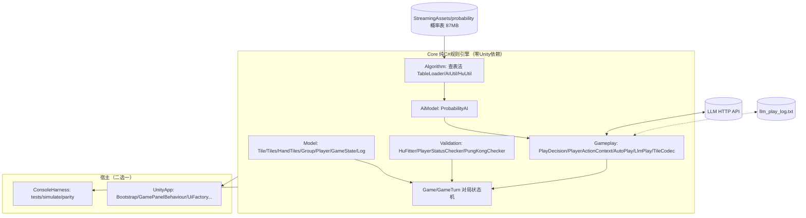
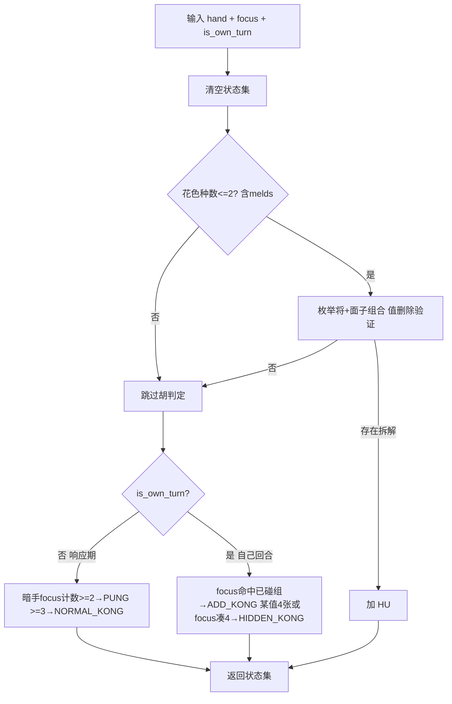
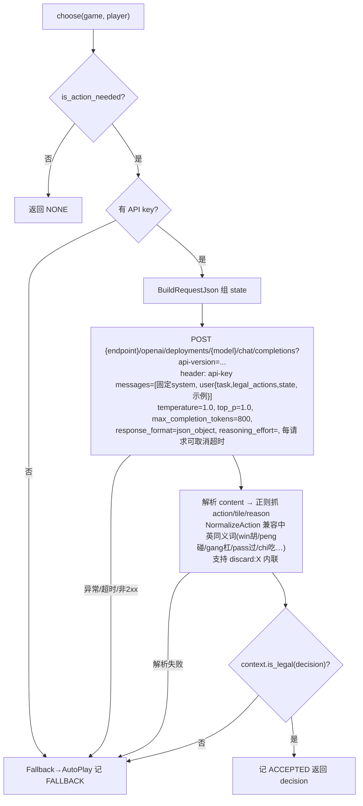

# 四川麻将 模块功能规格文档（面向 AI 编码代理实现）

> 版本：v3.0（2026-07-13）
> v3.0 修订：补充 **Unity updated UI 界面排版规格**——牌桌整体下移、AI/player avatar 随机选择与居中裁剪、资源目录、绘制顺序与验收标准；Core 规则、概率 AI、LLM Play 与无头模拟器语义均未改变。**本轮仅更新中文版**（英文版 `SichuanMahjong_Module_Requirements_EN.md` 仍为 v1.1/旧英文参考，待后续同步到 v3）。
> v2.0 修订：M3 补全**弃牌选择（`out_ai`）与评分函数（`calc`）的完整算法规格**——伪代码、概率表行语义（key 构造 / jiang / p 含义与真实样例行）、数值算例、平分与初值边界、验收锚点；其余模块本轮未改动。**本轮仅更新中文版**（英文版 `SichuanMahjong_Module_Requirements_EN.md` 仍为 v1.1，待下轮同步）。
> v1.1 修订：按接口文档惯例（IEEE 29148 / API Reference 通行字段）为每个模块的每个函数补全**功能描述、参数说明、返回值、错误与边界行为、副作用**；每个模块新增"源码参照"小节（原实现类/方法→file:line 对照）；新增 §2.4 关键类与枚举速查；**依代码复核修正三处重要语义**——①七对/龙七对的实际实现（原文档描述有误，见 M2）；②加杠状态只对刚摸的牌触发；③概率 AI 的听牌分支因胡表未加载实际不可达（见 M3）。
> 用途：每个 standalone 模块规格可**直接交给 Codex / Claude Code 独立实现与测试**（推荐 C#/.NET 8 或 Python，均无需 Unity）。
> 配套文档：`SichuanMahjong_PRD_v2.md`（PRD 停留在特性层 what/why，函数级契约以本文档为准）

---

## 1. 游戏介绍

四人四川麻将：条(B)/万(C)/筒(D) 三门 × 1–9 × 4 = 108 张，无字牌。每人 13 张、随机庄家 14 张先行；轮流摸牌—出牌，他家可对弃牌胡/碰/杠，自己回合可暗杠/加杠；胡牌须"缺一门"（手牌花色 ≤2 门），胡型为标准胡（4 面子+1 将）与七对（龙七对分支存在但实际不可达，见 M2）；任一玩家胡牌即终局（暂无血战与计分）。真人座位支持三种决策来源：手动 / 概率 AI 代打（Auto Play）/ 大模型代打（LLM Play），三者共用同一规则引擎。

**架构特征**：规则引擎（Core）是零 Unity 依赖的纯 C#（asmdef 强制 `noEngineReferences:true`），Unity 只做表现层；另有 .NET 8 无头控制台（ConsoleHarness）可批量自对弈与对拍验证。**本文档的所有模块均来自 Core / Tools，天然 standalone。**

## 2. 总体架构与模块划分

### 2.1 架构图



### 2.2 模块清单、细分与 standalone 判定

| 模块 | 子模块 | 关键文件（`Assets/Scripts/` 下） | standalone |
|---|---|---|---|
| A 领域模型 | 牌/牌集/手牌/面子/玩家/快照/日志；三套牌编码 | `Core/Model/*`、`Core/Gameplay/TileCodec.cs` | ✅ |
| B 对局状态机 | 建墙发牌 / 回合推进 / 响应仲裁 / 分支处理器（胡碰杠过）/ 终局 | `Core/Game/Game.cs`、`GameTurn.cs` | ✅（可再拆：状态机 / 提示文本 / GameState 投影） |
| C 规则判定 | 胡牌拆解（标准/七对）/ 缺一门 / 碰杠可行性 / 组合生成器 | `Core/Validation/*`、`Core/Utils/Utils.cs` | ✅ |
| D 查表算法 | 表加载 / 整数牌码 / 听胡查询 / 打碰杠打分 | `Core/Algorithm/*` | ✅（可再拆：加载层 vs 决策层） |
| E 概率 AI | IAI 接口 + ProbabilityAI 桥接 | `Core/AiModel/*` | ✅ |
| F 决策与合法性 | PlayDecision 值对象 / 合法动作集生成 / 合法性校验 | `Core/Gameplay/{PlayDecision,PlayerActionContext}.cs` | ✅ |
| G 控制器 | AutoPlayController / LlmPlayController（HTTP+日志） | `Core/Gameplay/*Controller.cs` | ✅ |
| H 无头模拟器 | tests / simulate / parity 三命令 | `Tools/ConsoleHarness/Program.cs` | ✅ |
| I Unity 表现层 | 自举/主循环调度/UI 工厂/牌视图/胡牌展示/奖励/updated UI 头像排版 | `UnityApp/*`、`StreamingAssets/avatars/*` | ❌（Unity 表现层；v3 起补充关键布局规格） |

### 2.3 模块 × 创意/布局/素材/玩法/日志 对应

| 维度 | 对应模块 |
|---|---|
| 创意/规则 | B 状态机（一胡即止/杠连锁）、C 判定（缺一门/七对）、三模式设计（GAME_MODES） |
| 布局 | I：`Config.cs`（1920×960 逻辑坐标）、`UiFactory`（Swing 坐标系 uGUI 生成）、`GamePanelBehaviour` 各 Draw*；v3 updated UI 将 AI/player 牌区整体下移并增加 avatar 锚点 |
| 素材 | `StreamingAssets/img/{Bamboo,Character,Dot}/0N.png` 牌面、背景、50 帧奖励动画、`StreamingAssets/avatars/{ai_*.png,player_*.png}`、`sound/slot_win_01.wav`、probability 概率表 |
| 玩法 | E 概率 AI、F 合法性、G 控制器、I 的 3 秒调度与快捷键 |
| 日志 | `Core/Model/Log.cs`（UI 内存滚动日志）、G 的 `llm_play_log.txt`、CoreEnv.Println 钩子 |

### 2.4 关键类与枚举速查（Core 全量）

| 类/枚举 | 文件 | 职责（一句话） |
|---|---|---|
| `Tile` | `Core/Model/Tile.cs` | 单张牌：`(type, number)` 值等价（`Equals` 忽略 index）；`ToString()` 即传输码 `"C7"` |
| `Tiles` | `Core/Model/Tiles.cs` | 有序牌集合基类：花色（B<C<D）后点数排序；`Remove` 按值删首个并重排 |
| `HandTiles : Tiles` | `Core/Model/HandTiles.cs` | 手牌：暗牌 + 单独存放的 `newTile` + 已亮碰/杠面子；含摸牌/弃牌/碰/三种杠的变更方法 |
| `Group : Tiles` | `Core/Model/Group.cs` | 归类牌组（顺/刻/对/碰/杠）；`GetDup()` 以 identification 自增制造"不相等副本" |
| `Player` | `Core/Model/Player.cs` | 座位：手牌 + 弃牌桌 + 状态标志集；`Plays` 弃牌（找不到牌时先兜底再抛错）；身份 = name |
| `AI1/AI2/AI3 : Player` | `Core/Model/AI{1,2,3}.cs` | 三个 AI 座位（逐字节相同的重复代码）：`PlayAction` 自动弃牌、`OtherAction` 响应决策 |
| `GameState` | `Core/Model/GameState.cs` | 真人视角只读快照；`GetPlayerHand()` 返回含 newTile 的副本 |
| `Log` | `Core/Model/Log.cs` | 带时间戳的内存事件日志；`GetLastXMessages(x)` 取尾部 x 条（UI 显示用） |
| `TileCodec` | `Core/Gameplay/TileCodec.cs` | `"C7"` ⇄ Tile 编解码 + 中文显示（B1→"幺鸡"） |
| `TileTypeEnum` | `Core/Model/TileTypeEnum.cs` | `{B, C, D}`＝条/万/筒；**枚举声明顺序即排序序** |
| `GroupEnum` | `Core/Model/GroupEnum.cs` | `{SEQUENCE, TRIPLE, PAIR, PUNG, NORMAL_KONG, ADD_KONG, HIDDEN_KONG}` |
| `PlayerStatusEnum` | `Core/Model/PlayerStatusEnum.cs` | `{HU, CHOW, PUNG, HIDDEN_KONG, ADD_KONG, NORMAL_KONG, WIN, WAITING, PLAYING}`（集合，非互斥；WIN 未被引擎使用） |
| `PlayerActionEnum` | `Core/Model/PlayerActionEnum.cs` | AI 响应枚举 `{HU, CHOW, PUNG, KONG, SKIP}` |
| `HuFitter` / `PlayerStatusChecker` / `PungKongChecker` | `Core/Validation/*` | 胡牌拆解枚举 / 状态判定（构造即副作用）/ 碰杠谓词 |
| `Utils.GetCombinations` | `Core/Utils/Utils.cs` | n 组合生成器（刻意保留 Java Set 语义，HuFitter 依赖） |
| `MaJiangDef` / `TableLoader` / `AITable*` / `HuTable*` / `AIUtil` / `HuUtil` | `Core/Algorithm/*` | esrrhs/majiang_algorithm 运行时子集：牌码常量 / 表解析 / 三张 AI 概率表 / 三张胡表（未加载）/ 打碰杠打分 / 胡听查询 |
| `IAI` / `ProbabilityAI` | `Core/AiModel/*` | AI 策略接口 / 领域对象→整数码桥接实现 |
| `PlayDecision` / `PlayerActionContext` | `Core/Gameplay/*` | 决策值对象 / 合法动作真值源 |
| `IPlayController` / `AutoPlayController` / `LlmPlayController` | `Core/Gameplay/*` | 真人座控制器抽象 / 概率 AI 代打 / LLM 代打（HTTP+日志+回退） |
| `WinningHandArranger` | `Core/Gameplay/WinningHandArranger.cs` | 赢家暗牌的展示用分组排列（回溯拆分，供胡牌弹窗） |
| `Game` / `GameTurn` | `Core/Game/*` | 对局状态机 / 4 座轮转队列 |
| `CoreEnv` | `Core/CoreEnv.cs` | 宿主副作用钩子：`Beep`、`Println`（默认 no-op；Unity→Debug.Log，无头→Console） |

---

## 3. Standalone 模块功能规格

统一约定：牌传输码 `"<B|C|D><1-9>"`（B=条、C=万、D=筒，如 `C7`=七万）；座位 0=真人（YOU），1..3=AI。每个接口按 **功能 / 参数 / 返回 / 错误与边界 / 副作用** 五要素描述（纯函数省略副作用项）。

---

### 模块 M1：牌与编码（Tile Domain & Codec）

**功能**：定义牌、牌集合、手牌（含碰/杠面子）与三套编码互转。所有其他模块的基础。

**数据结构**：

```
TileType ∈ {B, C, D}                     // 排序序 B < C < D（枚举声明顺序）
Tile { type: TileType, number: 1..9 }    // 值相等语义（type+number），忽略 index
Group { tiles: Tile[], category: SEQUENCE|TRIPLE|PAIR|PUNG|NORMAL_KONG|ADD_KONG|HIDDEN_KONG }
HandTiles {
  tiles: Tile[]         // 暗手牌（有序：先花色后点数）
  newTile: Tile?        // 刚摸的牌单独存放，不并入 tiles，出牌/判定时合并视图
  melds: Group[]        // 已亮的碰/杠（原实现分 pung/kong 两个列表）
}
```

**接口详细说明**：

`code(tile: Tile) -> str`
- **功能**：牌 → 传输码，即 `枚举名 + 数字`（`"C7"`）。
- **返回**：字符串；null 牌 → 空串（原实现语义）。

`from_code(s: str) -> Tile?`
- **功能**：传输码 → 牌。
- **参数**：`s` — 任意字符串。
- **返回**：Tile 或 null。**失败一律返回 null，不抛异常**：长度 <2、首字符 ∉ {B,C,D}、数字部分非整数、数字 ∉ 1..9 均为 null（`TileCodec.cs:12`）。

`display(tile: Tile) -> str`
- **功能**：中文显示名。**特例 `B1` → "幺鸡"**；其余为 "一..九" + 万/条/筒（`TileCodec.cs:37`）。

`to_card(tile: Tile) -> int`
- **功能**：领域牌 → 算法整数码（M3 概率表用）。映射：**万(C)=1..9、筒(D)=10..18、条(B)=19..27**——注意与显示/排序序（B<C<D）不同（`ProbabilityAI.cs:49`）。
- **返回**：1..27。

`from_card(n: int) -> Tile`
- **功能**：逆变换：1-9→C、10-18→D(−9)、其余→B(−18)（`ProbabilityAI.cs:62`）。
- **错误与边界**：n ∉ 1..27 → 抛参数错误（原实现未防御，重实现从严）。

`sort(tiles: Tile[]) -> Tile[]`
- **功能**：先花色（B<C<D）后点数升序，稳定排序（`Tiles.cs:41`）。

`HandTiles.add(tile: Tile) -> None`
- **功能**：摸牌语义：**旧 `newTile`（若有）先归入暗手并重排序，新牌置为 `newTile`**——手牌任意时刻至多一张"新牌"（`HandTiles.cs:18`）。
- **副作用**：修改 tiles 与 newTile。

`HandTiles.remove_for_discard(tile: Tile) -> Tile?`
- **功能**：弃牌语义，查找顺序：①与 `newTile` 引用相同 → 删 newTile；②暗手中首张值等牌 → 删之并把 newTile 并入暗手；③`newTile` 值等 → 删 newTile。
- **返回**：实际删除的牌；找不到 → **返回 null（不抛）**，由调用方（`Player.Plays`）兜底（`HandTiles.cs:33`）。
- **副作用**：修改 tiles/newTile。

`HandTiles.add_pung(tile: Tile) -> None`
- **功能**：碰：从暗手按值删 **2** 张（第 3 张来自他家弃牌），生成 3 张 `Group(PUNG)` 入 melds，重排序（`HandTiles.cs:76`）。

`HandTiles.add_normal_kong(tile: Tile) -> None`
- **功能**：明杠：从暗手删**全部**值等牌（3 张），生成 4 张 `Group(NORMAL_KONG)`（`HandTiles.cs:90`）。

`HandTiles.add_add_kong() -> None`
- **功能**：加杠：找到首个第 2 张与 `newTile` 值等的已碰面子，移除该碰、生成 4 张 `Group(ADD_KONG)`、置 `newTile=null`（`HandTiles.cs:98`）。
- **错误与边界**：无匹配碰面子时为 no-op（调用方应先用 M2 判定）。

`HandTiles.add_hidden_kong() -> None`
- **功能**：暗杠：扫描暗手——某值 **4 张** → 直接组杠；某值 **3 张且与 newTile 值等** → 含 newTile 组杠（置 null）。生成 `Group(HIDDEN_KONG)`，只处理**首个**命中值（`HandTiles.cs:114`）。

**关联领域对象**（供 M5/M6 引用）：
- `Player`：状态标志集 `HashSet<PlayerStatusEnum>`（初始 `{WAITING}`）；`Plays(tile)` 弃牌——`remove_for_discard` 失败时兜底（newTile → 首张暗牌），仍失败**抛 ArgumentException**，成功后牌入弃牌桌 `table`（`Player.cs:23`）；`ClearStatus()` 清 HU/吃/碰/杠位但**不动 PLAYING/WAITING**（`Player.cs:187`）；身份 = `name`（`Equals/GetHashCode`）。
- `GameState`：真人视角只读快照；`GetPlayerHand()` 返回**含 newTile** 的副本（`GameState.cs:44`）。
- `Log`：`AddMessage(msg)` 追加带 `DateTime.Now` 的条目；`GetLastXMessages(x)` 取尾部 x 条（x 负值按 0）（`Log.cs:33,38`）。

**源码参照**：

| 原实现 | 位置 | 说明 |
|---|---|---|
| `Tile.Equals/GetHashCode` | `Tile.cs:40-48` | 值等价 `(type,number)`；hash = `(int)type*31+number` |
| `Tiles.Add/Remove/Sort` | `Tiles.cs:22-54` | Add 只追加不排序；Remove 按值删首个后 Sort |
| `HandTiles` 全部方法 | `HandTiles.cs:18-190` | 摸/弃/碰/杠语义如上 |
| `Group.GetDup()` | `Group.cs:31` | 共享同一牌列表、identification 自增 → 与原组**不相等**；HuFitter 靠它允许同一顺子用两次 |
| `TileCodec` | `TileCodec.cs:7-37` | code/from_code/display |
| `ProbabilityAI.TileToCard/CardToTile` | `ProbabilityAI.cs:49-73` | to_card/from_card 的原实现（私有方法） |

**验收标准**：`code/from_code` 与 `to_card/from_card` 双向往返一致（27 张全覆盖）；`from_code("E5")==null`、`from_code("C0")==null`；排序稳定；`add`/`remove_for_discard` 的 newTile 语义用例（摸 C7 打 C7=摸切、摸 C7 打手中 B2=手切，B2 删除后 C7 并入暗手）。

---

### 模块 M2：胡牌与状态判定（Hu/Pung/Kong Validator）★规则核心

**功能**：给定玩家手牌（含 newTile、melds）与一张关注牌，判定其可执行状态集合：能否胡、碰、明杠、加杠、暗杠。复刻 `PlayerStatusChecker`/`HuFitter`/`PungKongChecker` 语义。

**接口详细说明**：

`check_status(hand: HandTiles, focus: Tile, is_own_turn: bool) -> set[Status]`
- **功能**：一次性计算全部可执行状态。内部流程：缺一门闸 → 生成组集合 → 标准胡/七对拆解 + 值删除验证 → 碰杠谓词。
- **参数**：`hand` — 手牌（含 melds）；`focus` — 关注牌（自己摸的或他家打的）；`is_own_turn` — 是否自己回合（对应原实现用 `IsPlaying/IsWaiting` 区分）。
- **返回**：`{HU, PUNG, NORMAL_KONG, ADD_KONG, HIDDEN_KONG}` 的子集。
- **错误与边界**：focus 为 null → 抛参数错误。
- **副作用**：**无**——注意原实现 `PlayerStatusChecker` 是"构造即副作用"（构造函数直接改写传入 Player 的状态集，`PlayerStatusChecker.cs:18-41`）；重实现应改为纯函数返回状态集，由调用方落位。

`can_hu(hand: HandTiles, extra: Tile?) -> bool`
- **功能**：14 张视图（暗手 + newTile + extra）能否胡。等价于 `check_status` 的 HU 位。
- **返回**：bool。

`fit_all_hu(hand) -> list[HuDecomposition]`
- **功能**：返回所有胡牌拆解候选（未经值删除验证的组合枚举，对拍 `HuFitter.FitAllHu`），供展示/调试。
- **返回**：拆解列表（每个 = 将 + 面子组，或 7 对子）。

**算法**（必须逐条一致）：

1. **缺一门闸**：统计 暗手牌 + newTile + **已亮碰/杠面子** 的花色种数（melds 计入花色统计，`PlayerStatusChecker.cs:115-131`），花色种数 >2 直接不可胡。
2. **生成组集合**：牌按花色分组；每组枚举全部 3 元组合（组内恰 2 张时用 2 元特例），从中抽取 PAIR（2 同值）、TRIPLE（3 同值）、SEQUENCE（同花连 3）；组用 `identification=1` 值等价去重（同值 4 张只产生 1 个不同的 PAIR 组）。另外每个 SEQUENCE 生成一个 `Dup` 副本（identification 自增使其不等于原组），**允许同一顺子形态被用两次**（如 445566 = 456+456）（`HuFitter.cs:26-41`）。
3. **标准胡**：`需要面子数 = 4 - 已亮碰杠数`；遍历每个候选将（PAIR）× 组集合的 C(组集合, 需要数) 组合；对每个候选做**值删除验证**：从 14 张（13+focus）中按值恰好删光 → 胡（`HuFitter.cs:57-72`、`PlayerStatusChecker.cs:193-207`）。
4. **七对**：候选条件为 `pair 组数恰好 = 7`，即暗手 14 张构成 **7 个不同对子值**；纯一色记清七对（仅标签，不加番）（`HuFitter.cs:74-101`）。
   ⚠️ **移植缺陷（对拍时必须保持；修复须显式声明并同步 PRD）**：
   - 代码中"龙七对"分支的门槛是**已亮杠面子 ≥3**（`kong.Count >= 3`，`HuFitter.cs:81`）。但 3 个亮杠占 12 张牌，与"暗手 7 对需 14 张"互斥 ⇒ **该分支实际永不可达**（死代码）。
   - 真正的龙七对手牌（暗手 5 对 + 1 坎四张 = 6 个不同值）`pair` 组数只有 6，**不会被识别为七对**；除非恰好能按标准胡拆解（如对子恰为连续数字可拆顺子），否则判**不可胡**。
5. **碰/杠可行性**（`PungKongChecker.cs`）：
   - 碰：非自己出牌回合（`!IsPlaying`）且 暗手含 focus **≥2** 张；
   - 明杠：非自己出牌回合 且 暗手含 focus **≥3** 张；
   - 加杠：自己回合（`!IsWaiting`）且 **focus（刚摸的牌）与某个已碰面子值等**——⚠️ 只看刚摸的牌：手中旧有的第 4 张**不会**触发加杠状态（`PungKongChecker.cs:40-55`）；
   - 暗杠：自己回合 且（暗手某值 **=4** 张，或 focus 与暗手 **≥3** 张值等凑满 4）。

**判定流程图**：



**源码参照**：

| 原实现 | 位置 | 说明 |
|---|---|---|
| `PlayerStatusChecker(player, newTile)` | `PlayerStatusChecker.cs:18-41` | 构造即副作用：拷贝暗手+newTile、导入已亮碰杠、`SetTiles()` 全流程 |
| `PlayerStatusChecker.UpdateStatus()` | `PlayerStatusChecker.cs:67-95` | `ClearStatus` 后依次落 HU/PUNG/NORMAL_KONG/HIDDEN_KONG/ADD_KONG，每次 `CoreEnv.Println` |
| `PlayerStatusChecker.CheckHu/IsMissingOneSuit` | `PlayerStatusChecker.cs:97-131` | 缺一门闸（`suits.Count <= 2`，含 melds）→ HuFitter → 值删除 |
| `PlayerStatusChecker.GenerateSets/SetGroups` | `PlayerStatusChecker.cs:141-191` | 组集合生成（3 元组合枚举 → PAIR/TRIPLE/SEQUENCE） |
| `PlayerStatusChecker.CanHuFromHand` | `PlayerStatusChecker.cs:193-207` | 值删除验证（删光即胡） |
| `HuFitter.FitStandardHu/FitSevenPairsHu` | `HuFitter.cs:57-101` | 标准胡组合枚举 / 七对（含不可达的龙七对分支） |
| `PungKongChecker.CanPung/CanNormalKong/CanAddKong/CanHiddenKong` | `PungKongChecker.cs:20-70` | 四个纯谓词 |
| `Utils.GetCombinations<T>(list, n)` | `Utils.cs:14` | n 组合生成器；**刻意保留 Java Set 语义**（加入等值元素是 no-op 但删除会删掉先前的等值元素），HuFitter 依赖，注释见 `Utils.cs:7-13` |

**验收标准**（最少用例集）：
- 标准胡：`B1B1B1 B2B3B4 C5C6C7 C7C8C9 + D5D5`——含 D 共三门 → **不可胡**；改 `C5C5` 将则两门可胡；
- 同顺子两次：`C4C4C5C5C6C6` + 其余合法面子 + 将 → 可胡（验证 sequenceDup 语义）；
- 七对：`B1B1 B3B3 B5B5 C2C2 C4C4 C6C6 C8C8` 可胡；**负用例（对拍锚点）**：`B1B1B1B1 B3B3 B5B5 C2C2 C4C4 C6C6`（含坎四张，6 个不同值）→ 按当前实现**不可胡**；
- 已碰 1 组时只需 3 面子 + 1 将；
- 碰/杠：手持 `C7C7` 他家打 `C7` → PUNG；`C7C7C7` → PUNG+NORMAL_KONG；已碰 C7 且**自摸**第 4 张 `C7` → ADD_KONG；已碰 C7、第 4 张 C7 早已在手（非刚摸）→ **无** ADD_KONG（负用例）；
- 性能：单次 `check_status` 在普通手牌上 <10ms。

---

### 模块 M3：查表算法层（Probability Table & Scoring）

**功能**：加载概率表并提供“手牌 → 概率评分 / 听牌查询 / 打碰杠决策原语”。复刻 `Core/Algorithm`（esrrhs/majiang_algorithm 运行时子集）。整数牌码宇宙为 42 张（万/筒/条/风/箭/花），本游戏只用 1..27。

**表文件格式与行语义**（`StreamingAssets/probability/`）：
- `majiang_ai_normal.txt`（87.4MB，810,700 行）：数字门共用——**万/筒/条只要点数分布相同就查同一行**；
- `majiang_ai_feng.txt`（1,240 行）、`majiang_ai_jian.txt`（250 行）：本游戏发牌不产生风/箭（对应 key 恒为 0），但加载顺序（jian→feng→normal）与内容必须保留以保持行为一致；
- 行格式：`<key> <jiang:0|1> <p:double> <人类可读注释...>`，仅前 3 列参与解析（`TableLoader.cs:15`）。真实样例行（normal 表）：

```
0 0 1.0  无将 1.0
0 1 0.05480530240265118  有将 0.05480530240265118
12 0 0.0016140602582496414 8万9万9万 无将 0.0016140602582496414
12 1 0.013707897514633905 8万9万9万 有将 0.013707897514633905
```

- **key 列**：该门 1..9 点各自张数拼成的十进制数，**1 点在最高位、9 点在个位**（`HuUtil.BuildKeys`，`HuUtil.cs:314`：`key = key*10 + count[rank]`，rank 从 1 迭代到 9）。例：`8万9万9万` → 点数分布 `[0,0,0,0,0,0,0,1,2]` → key = `000000012` = 12。风门 4 位、箭门 3 位，同理。
- **jiang 列**：该行代表把这门牌按"**其中含将**（雀头对子）"（jiang=1）还是"**不含将**"（jiang=0）的角色去凑面子。同一 key 通常有两行（无将/有将各一行）。
- **p 列**：该门型在该角色下**最终凑齐所需面子（含将则再加一对）的概率权重**——由 esrrhs/majiang_algorithm 离线预计算后固化进表，**运行时只查表、不做任何概率计算**。两个直觉锚点：空门 key=0 的 `无将 p=1.0`（什么都不缺，视为已完成）、`有将 p≈0.055`（要求空门凭空凑出将，概率极低）；门型越接近完整面子 p 越高。
- ⚠️ 常见误解：表里**不存在**"某张牌该被弃掉的概率"这类条目——弃牌是"逐一试删后给剩余手牌评分取 argmax"（见 `out_ai`），概率表只是评分的查询底座。

**接口详细说明**：

`load_ai_table(lines) -> dict[long, list[{jiang: bool, p: double}]]`
- **功能**：解析 AI 概率表：每行前 3 列 → `key`(long) / `jiang`(int→bool) / `p`(double, InvariantCulture)，同 key 追加成列表。
- **错误与边界**：空行跳过；格式坏行 → 抛解析错误（原实现直接崩，重实现给行号）。
- **副作用**：目标字典先清空再载入（原实现 `AITable.Load`）。

`build_keys(cards: int[]) -> {wan_key, tong_key, tiao_key, feng_key, jian_key}`
- **功能**：42 槽计数向量 → 每类一个 base-10 long key（每位 = 该点数张数，`HuUtil.cs:314`）。本游戏 feng/jian key 恒为 0。

`is_ting(cards: int[]) -> list[int]`
- **功能**：13 张手牌听哪些张（返回赢张整数码列表）。
- ⚠️ **运行时语义（对拍关键）**：查询依赖 `HuTable*` 三张胡表，**而本游戏从不加载胡表**（`HuTable.cs:5-10` 注释明示）——因此运行时 `is_ting` **恒返回空**。重实现若自行加载/生成胡表，会改变 `calc`/`out_ai` 的行为，导致 parity 失败。**默认要求：不加载胡表，保持恒空**；如需真实听牌功能，作为独立扩展接口并显式声明。

`calc(cards: int[], gui: int[] = []) -> double` ★评分函数（弃牌/碰/杠决策共用的唯一评分核心）
- **功能**：给一手牌打"成胡潜力"分。它评估的是**手牌整体**（而非某张牌）：把手牌按万/筒/条/风/箭五类拆 key 查概率表，枚举"将放在哪一门"的所有安排，返回最优安排的概率和（`AIUtil.cs:11-52`）。
- **参数**：`cards` — 手牌整数码列表（13 或 14 张均可）；`gui` — 鬼牌（万能牌）列表，本游戏恒空。
- **算法**（必须逐条一致，对拍 `AIUtil.Calc` + `CalcAITableInfo`，`AIUtil.cs:54-79`）：

```
calc(cards, gui=[]):
  counts ← 42 槽计数向量（本游戏只用 1..27）；gui 牌计入 guiNum 并从 counts 清零（本游戏恒 0）
  # ① 听牌分支——运行时不可达：依赖的胡表从不加载，is_ting 恒空（见 is_ting 条目）
  ting ← is_ting(counts, guiNum)
  if ting 非空: return len(ting) * 10
  # ② 构造五类 key 并查表（万/筒/条 → normal 表；风 → feng；箭 → jian）
  keys ← build_keys(counts)
  rows[k] ← 表[keys[k]]           # 每 key 常见 2 行：jiang=0 / jiang=1
  # ③ DFS 组合：五类各选一行，全局【恰好一个】jiang=1 行，p 相加，取最大
  return max{ Σ p(选中行) | 五类各取一行，其中恰有一行 jiang=1 }
```

- **三条硬语义**（重实现最容易做错的地方）：
  1. 各门 p 是**相加**（`cur + p`），不是相乘；
  2. **全局恰好一个将**：某门一旦选了 jiang=1 行，其余门只能选 jiang=0 行；一整套组合里没有任何将行 → 该组合直接丢弃不计；
  3. 返回所有合法组合中的**最大值**（`ret.Max()`）。
- **数值算例**（真实表值，可直接作单测锚点）——设手牌只有 `8万9万9万`（其余四类空门）：万 key=12（无将 0.00161 / 有将 0.01371），筒/条 key=0（无将 1.0 / 有将 0.05481），风 key=0（有将 0.05611）、箭 key=0（有将 0.05882）。合法组合 = "恰一门当将"共 5 种：**将放万 = 0.01371+1+1+1+1 = 4.01371（最大，即返回值）**；将放筒 = 0.00161+0.05481+1+1+1 ≈ 3.05642，其余更低。可见空门贡献 1.0 底分，评分实际反映"非空门离完成多远 + 将放哪门最划算"。
- **错误与边界**：某门 key 查表无行时原实现可能空集 `Max()` 抛异常/空引用——实践中被"normal 表全量加载"掩盖；重实现应显式处理（返回 0 分并记警告）。

`out_ai(cards: int[]) -> int` ★弃牌选择（枚举-评分 argmax）
- **功能**：当前隐藏手牌集合的建议弃牌（普通摸牌回合通常是 13 张暗手牌 + 1 张 `newTile`；若已有碰/杠面子则数量相应减少）。**注意：不是"查每张牌被弃的概率"**——概率表中不存在该概念；而是对每种候选牌**假设弃掉后**给剩余手牌调 `calc` 评分，弃掉使剩余手牌评分最高的那张（`AIUtil.cs:81-107`）。
- **局限**：`out_ai` 只看传入的手牌整数码列表；不读取四家弃牌桌、已亮碰/杠、牌墙剩余信息，也不会根据某张牌已经公开出现几次来调整评分。因此它是"手牌结构评分"型 baseline，不是完整牌局信息型 AI。
- **算法**（必须逐条一致）：

```
out_ai(input14):
  max ← ε          # 最小正 double（Java Double.MIN_VALUE 语义 = C# double.Epsilon），不是负无穷
  ret ← 0
  for c in input14 按列表顺序、同值只试一次（cache 去重）:
    if c 是鬼牌: continue            # 本游戏无鬼牌，恒不跳
    score ← calc(input14 移除一张 c)  # 假设弃掉 c
    if score > max: max ← score; ret ← c   # 严格大于才更新
  return ret
```

- **返回**：弃牌整数码；无任何候选得分超过初值 ε → 返回 0（调用方 `from_card(0)` 未定义，须由 M4 兜底）。
- **语义细节**（重实现必须一致）：
  - **平分不换**：比较是严格 `>`，评分并列时**先遍历到的候选获胜**；遍历顺序 = M4 `set_hand` 产出的列表顺序（暗手排序在前、newTile 在末尾）；
  - **初始 max 必须为最小正 double**（`AIUtil.cs:84-86` 注释明示，**不是** `double.MinValue`/负无穷）——这决定了全 0 分手牌返回 0 的语义；
  - 复杂度：候选 ≤14 种 × 每次 `calc` 的 DFS（每 key 至多 2 行 → 组合数 ≤2⁵ 量级），单次决策毫秒级。

`peng_ai(cards: int[], card: int) -> bool` / `gang_ai(cards: int[], card: int) -> bool`
- **功能**：是否碰/杠：碰 = 手含 ≥2 张 card 且 `碰后评分 + award ≥ 碰前评分`；杠 = 手含 ≥3 张且同式（杠删 4 张）。
- **参数**：`award` — 碰/杠奖励分，**本游戏调用恒传 0.00**（`ProbabilityAI.cs:22-29`）。
- **返回**：bool；card 为鬼牌或张数不足 → false。

**源码参照**：

| 原实现 | 位置 | 说明 |
|---|---|---|
| `MaJiangDef` | `MaJiangDef.cs:11-36` | 42 槽牌码常量：WAN1..9=1..9、TONG=10..18、TIAO=19..27、FENG=28..31、JIAN=32..34、HUA=35..42 |
| `TableLoader.LoadAiTable/LoadHuTable` | `TableLoader.cs:15-39` | 表解析；胡表行格式 `key gui jiang hu`（hu=-1 表示"已完成"） |
| `AITable/AITableFeng/AITableJian` | `AITable.cs:6-30` | 三张静态 AI 表；`Load` 先 Clear |
| `HuTable/HuTableFeng/HuTableJian` | `HuTable.cs:6-33` | 三张胡表——**运行时从不加载**（类注释 `HuTable.cs:5-10`） |
| `HuUtil.IsHuCard/IsTingCard/BuildKeys` | `HuUtil.cs:46-339` | 胡/听查询 DFS；终止条件 `(guiNum%3==0 && jiang) || (guiNum%3==2 && !jiang)` |
| `AIUtil.Calc/OutAI/PengAI/GangAI/ChiAI` | `AIUtil.cs:11-224` | 评分与决策原语；ChiAI 存在但本游戏不用（无吃） |

**验收标准**：用真实表文件加载后 key 数与行数一致；固定手牌（ConsoleHarness `tests` 中 TestAI 的手牌）的 `out_ai` 结果与原实现一致；`parity` 格式对拍通过（见 M8）；**`is_ting` 在未加载胡表时恒返回空**的负用例；`calc` 对"`8万9万9万` + 四类空门"手牌返回 ≈4.01371（依上文真实表值算例）；"恰一个将"约束用例（全无将组合不得计入候选）；`out_ai` 平分时返回先遍历到的候选的用例；全 0 分手牌 `out_ai` 返回 0 的用例。

---

### 模块 M4：概率 AI 玩家（ProbabilityAI）

**功能**：实现 `IAI` 接口，把 M1 领域对象桥接到 M3 整数码并给出决策。

**接口详细说明**（`IAI`，`IAI.cs:8-13`）：

`set_hand(hand: HandTiles) -> None`
- **功能**：快照手牌：暗手 + newTile → 整数码计数列表 `cards`（melds、各家弃牌桌、其他公开牌均不计入）。**每次决策前必须先调用**（AI 座位在 `PlayAction/OtherAction` 开头刷新）。
- **副作用**：替换内部 cards 快照。

`should_pung(tile: Tile) -> bool`
- **功能**：`= peng_ai(cards, to_card(tile), award=0.00)`。

`should_kong(tile: Tile) -> bool`
- **功能**：`= gang_ai(cards, to_card(tile), award=0.00)`。

`should_chow(tile: Tile) -> bool`
- **功能**：**恒返回 true**（`ProbabilityAI.cs:34`）。历史遗留；四川麻将无吃，且引擎从不落 CHOW 状态位（见 M5），调用方不会依赖。

`should_skip(tile: Tile) -> bool`
- **功能**：`= !should_pung && !should_kong && !should_chow`——因 should_chow 恒 true，**实际恒返回 false**（`ProbabilityAI.cs:39`）。同为遗留语义，保持即可。

`get_tile_to_play() -> Tile`
- **功能**：`= from_card(out_ai(cards))`，建议弃牌。
- **错误与边界**：`out_ai` 返回 0（无有效候选）时 `from_card(0)` 语义未定义——原实现未防御；重实现应兜底返回手牌首张并记警告。

**源码参照**：`ProbabilityAI.cs:12-73`（含 TileToCard 花色映射 C→万/D→筒/B→条）；AI 座位的使用方式见 `AI1.cs:15-38`（`PlayAction` 自动弃牌 / `OtherAction` 响应，优先级 **碰 > 吃 > 杠 > 过**，各分支同时要求状态位与 AI 谓词都为真；AI2/AI3 逐字节相同）。

**验收标准**：`set_hand` 后 cards 计数总和 = 暗手张数 + (newTile?1:0)；`get_tile_to_play` 返回的牌必在手中；与 M3 的 `tests` 固定手牌结果一致。

---

### 模块 M5：对局状态机（Game Engine）★工程量最大

**功能**：完整对局生命周期：建墙、洗牌、发牌、回合推进、出牌响应仲裁、胡/碰/杠/过分支处理、流局/异常终局；对外提供状态快照与事件文本。复刻 `Game.cs`/`GameTurn.cs` 语义，并按 PRD-F7 增加**种子注入**（原实现为无种子 `static Random`，`Game.cs:25`——种子参数是本规格的新增要求）。

**构造**：`Game(seed: int?, controllers: IPlayController?[4]?)` —— 建 108 张牌（3 门 × 1..9 × 4，`Game.cs:43-53`）→ `Random(seed)` Fisher-Yates 洗牌 → 每人 13 张 → `random.next(4)` **随机庄家**多摸 1 张置 PLAYING（`Game.cs:72-94`）→ 从庄家起推进直到轮到真人等待输入。

**对外接口详细说明**：

`is_over() -> bool` / `get_winner() -> Player?` / `get_winning_tile() -> Tile?`
- **功能**：终局查询。`winner==null 且 is_over` = 流局或异常。无副作用。

`get_turn_player() -> Player` / `get_round() -> int`
- **功能**：当前回合玩家 / 已推进回合数（`GameTurn.Next()` 每次 +1）。

`get_game_state() -> GameState`
- **功能**：真人视角快照（部分可观测）：`{turn_player, round, player_hand(含newTile), player_new_tile, player_melds, 4家弃牌桌, tiles_to_draw}`。
- **错误与边界**：**不得泄露对手暗牌与牌墙内容**（快照只含真人手牌与公开信息）。

`process_played() -> None`
- **功能**：真人出牌后调用：进入弃牌响应仲裁（流程见状态机图）。
- **副作用**：可能推进多个回合直至下一个决策点。

`process_hu(p) / process_pung(p) / process_kong(p, kind) / process_skip(p) -> None`
- **功能**：四个分支处理器（真人按钮入口；AI 的同名分支由引擎内部调用）：
  - `process_hu`：确定赢张（自摸=newTile；接炮=lastPlayedTile，并从放炮者弃牌桌移回）、置 winner、**立即 ended=true（一胡即止）**（`Game.cs:227-253`）；
  - `process_pung`：亮碰 → 以碰家重建轮转队列 → 碰家出牌 → `process_played()`（`Game.cs:263`）；
  - `process_kong`：按 kind（明/加/暗）亮杠 → **补摸 1 张**（牌墙空→流局返回）→ 置 PLAYING → **对补牌重新跑状态判定**（可连杠/杠上胡）→ 以杠家重建队列 → 真人则等输入，AI 则可胡即 `process_hu`、否则出牌（`Game.cs:278-328`）；
  - `process_skip`：自己回合（过杠）→ 清杠状态位、保持 PLAYING 继续出牌；响应期 → 清状态、下家置 PLAYING → `next()`（`Game.cs:330-346`）。
- **错误与边界**：`process_kong` 传入非法 kind → 抛 `InvalidOperationException`（原实现语义）。

`get_action_version() -> int`
- **功能**：每次 `RecordAction`（任何状态变更）自增 1（`Game.cs:348-354`），供 UI/控制器防过期决策（配合手牌哈希）。

`get_log() -> list[str]`
- **功能**：事件文本日志（`Log.GetLastXMessages`）。

**状态机**（必须一致，含已知规则简化）：

```
                 ┌──────────────────────────────┐
                 │ 构造: 建108张→洗牌→发牌        │
                 │ 随机庄家+1张,置PLAYING         │
                 └──────────────┬───────────────┘
                                ▼
        ┌────────────────── Next() ◄─────────────────────┐
        │ turnPlayer = 轮转队列.next()                     │
        │ 若 turnPlayer 已标 HU → ended                    │
        │ (非首轮)摸牌; 牌墙空→流局 ended                    │
        │ 状态判定 check_status(自己回合)                    │
        └────────────┬────────────────────────────────────┘
                     ▼
              turnPlayer 是真人? ──是──▶ [等待输入: 出牌/胡/杠/过杠]
                     │否                          │
                     ▼                            │
          AI: get_tile_to_play() → 打出            │
                     └────────────┬───────────────┘
                                  ▼
                        ProcessPlayed(): 弃牌响应仲裁
                        对"下家起3家"按座位顺序逐一:
                          该家可胡? 真人→等输入 / AI→ProcessHu→终局
                          该家可碰/杠? 真人→等输入 / AI→OtherAction(碰>杠>过)
                          都不可 → 看下一家
                        ※第一个有动作的座位截断后续(座位就近优先)
                                  │无人响应
                                  └────────────▶ 回 Next()

  ProcessHu(p):   winner=p, ended=true（一胡即止）
  ProcessPung(p): 亮碰 → 轮转队列以 p 重开 → p 出牌 → ProcessPlayed()
  ProcessKong(p): 亮杠(明/加/暗) → 补摸1张 → 以 p 重开队列 → 重新状态判定
                  (可连杠/杠上胡) → p 出牌或等真人输入
  ProcessSkip(p): 自己回合(过杠)→清杠状态继续出牌;
                  响应期→清状态, 下家置 PLAYING → Next()
  终局三态: win(winner!=null) / draw(牌墙空) / error(异常)
```

补充语义（对拍要点）：
- **响应仲裁是"座位就近优先"**：胡的优先级只在**同一座位内部**高于碰/杠；若近座 AI 选择碰、远座可胡，碰会截胡（`Game.cs:168-223`）。作为 benchmark 环境须在数据卡显式声明。
- AI 座位响应决策链 = 状态位 ∧ AI 谓词（`AI1.OtherAction`，优先级碰>吃>杠>过）；**CHOW 状态位从未被 `PlayerStatusChecker` 设置**，故 `ProcessChou`（实为"吃胡"路径：设 HU 后转 `ProcessHu`，`Game.cs:254`）实际不可达。
- AI 异常（如 `Player.Plays` 抛 ArgumentException）由 `Action()` 的 try/catch 捕获 → `EndErroredGame`（`Game.cs:144-166`）。

**源码参照**：

| 原实现 | 位置 | 说明 |
|---|---|---|
| `Game()` 构造 | `Game.cs:27-59` | 4 座位（player/ai1/ai2/ai3）+ 建墙 108 张 |
| `Shuffle/Deal/GetNextTile` | `Game.cs:61-106` | Fisher-Yates / 13×4+随机庄家 1 张 / 摸牌（空墙→流局） |
| `Next()/Action()` | `Game.cs:108-166` | 回合推进 / 真人等待 vs AI 自动 + 异常兜底 |
| `ProcessPlayed()` | `Game.cs:168-225` | 三家按座位序仲裁、首个有动作者截断 |
| `ProcessHu/Chou/Pung/Kong/Skip` | `Game.cs:227-346` | 五分支处理器 |
| `RecordAction/EndDrawGame/EndErroredGame` | `Game.cs:348-386` | actionVersion++ / 流局 / 异常终局 |
| 提示文本 Build*Prompt | `Game.cs:388-496` | 状态栏文本生成（可拆为独立子模块） |
| `GameTurn` | `GameTurn.cs:12-58` | 轮转队列：`Next/Peek/Peek3/GetPlayerAfter/GetRoundsUntilPlayer` |
| `CoreEnv.Beep/Println` | `CoreEnv.cs:14-15` | 宿主钩子（默认 no-op） |

**验收标准**：注入固定 seed 跑 1000 局全 AI（配 M4）：0 异常、无死循环（单局动作数上限 2000）、win/draw 分布合理、四座位均有胜场；同 seed 两次运行**逐事件一致**；`get_game_state()` 不泄露对手暗牌与牌墙。

---

### 模块 M6：合法动作上下文（PlayerActionContext）★LLM 安全网

**功能**：从 Game+Player 提取"当前是否需要行动、合法动作标签集、动作合法性校验、弃牌解析"。这是 benchmark 动作空间的**唯一真值源**。

**接口详细说明**：

`is_action_needed() -> bool`
- **功能**：`ContainsHu() || IsPlaying() || ContainsResponseAction()`——有任一状态位或轮到出牌（`PlayerActionContext.cs:17`）。

`legal_action_labels() -> list[str]`
- **功能**：生成合法动作标签（顺序固定，直接进入 LLM prompt）：
  ① 可胡 → 首位加 `"hu"`；
  ② 响应期（非 PLAYING 且有响应位）：按状态位依次加 `"chow"/"pung"/"kong"`，**恒以 `"skip"` 结尾**，返回；
  ③ 自己回合且可杠：加 `"kong","skip"`，返回；
  ④ 自己回合出牌：对 `unique_discard_tiles()` 每张加 `"discard:<码>"`（`PlayerActionContext.cs:30-73`）。
- **返回**：标签列表；`is_action_needed()==false` 时为空表。

`is_legal(decision: PlayDecision) -> bool`
- **功能**：逐 ActionType 校验：HU→`ContainsHu`；CHOW/PUNG→非 PLAYING 且对应状态位；KONG→`ContainsKong`；SKIP→（响应期有响应位）或（自己回合可杠）；DISCARD→`IsPlaying` **且 `!ContainsChouPungKong`**（有未决碰杠位时不得直接弃牌，须先 kong/skip）且 `resolve_discard_tile` 成功；NONE/未知→false（`PlayerActionContext.cs:75-100`）。
- **返回**：bool；不抛异常。

`resolve_discard_tile(tile: Tile) -> Tile?`
- **功能**：在 newTile 优先、然后暗手中按值找等价牌；找不到 → null（`PlayerActionContext.cs:102`）。

`unique_discard_tiles() -> list[Tile]`
- **功能**：候选弃牌去重列表：newTile 在前、暗手在后，按传输码去重（`PlayerActionContext.cs:123`）。

`PlayDecision`（值对象，`PlayDecision.cs`）：
- `{ action: HU|CHOW|PUNG|KONG|SKIP|DISCARD|NONE, tile: Tile?, reason: str, source: str }`，字段只读，null 字符串一律折叠为 `""`；
- 工厂：`of(action, reason, source)`（无 tile）/ `discard(tile, reason, source)` / `none(reason, source)`。

**验收标准**：胡+碰同时可用时 labels = `["hu","pung","skip"]`（顺序一致）；出牌回合 labels 与手牌唯一牌一一对应且 newTile 的牌排最前；`is_legal` 对不在集合中的动作/不在手的弃牌/有未决杠位时的 discard 返回 false。

---

### 模块 M7：代打控制器（AutoPlayController / LlmPlayController）

**功能**：真人座位的两种自动决策来源。`IPlayController = { get_name() -> str, choose(game, player) -> PlayDecision }`（`IPlayController.cs:8-9`）。

#### M7a AutoPlayController（概率 AI 代打，也是 LLM 的回退兜底）

`choose(game, player) -> PlayDecision`
- **功能**：决策链（`AutoPlayController.cs:17-56`）：
  ① `is_action_needed()==false` → NONE；
  ② **可胡必胡**（无条件 HU）；
  ③ 响应期 → 需 `get_last_played_tile()`（缺失→skip）；优先级 **杠 > 碰 > 吃 > 过**（注意与 AI 座位的 碰>吃>杠>过 **不同**，`AutoPlayController.cs:58-80`），各分支同时要求状态位与 M4 谓词；
  ④ 自己回合可杠 → `should_kong(find_kong_tile())` ? kong : skip（find_kong_tile = newTile 优先，否则首个 4 张值，`AutoPlayController.cs:100`）；
  ⑤ 出牌 → `get_tile_to_play()` 解析回手牌，失败兜底 newTile → 首张暗牌（`AutoPlayController.cs:82-98`）。
- **返回**：合法 PlayDecision（source="Auto Play"）。
- **副作用**：无 IO；决策纯本地。

#### M7b LlmPlayController（LLM 代打）

**输入（环境变量）**：`GPT_API_SG_KEY`（必需，缺失即回退）、`MAHJONG_LLM_MODEL`（默认 `gpt-5.5-2026-04-24`）、`MAHJONG_LLM_ENDPOINT`（默认值按 OS 硬编码内网域名，`LlmPlayController.cs:133-140`，须允许环境变量完全覆盖）、`MAHJONG_LLM_API_VERSION`（默认 `2025-01-01-preview`）、`MAHJONG_LLM_REASONING`（默认 `medium`）、`MAHJONG_LLM_TIMEOUT_SECONDS`（默认 18）。

**接口详细说明**：

`choose(game, player) -> PlayDecision`
- **功能**：LLM 决策全流程（见流程图）：组 state → POST chat/completions → 解析 → 合法性校验 → ACCEPTED 或 FALLBACK。
- **返回**：**任何路径都返回合法决策**（非法/超时/无 key/解析失败 → 回退 M7a 结果，reason/source 标注回退原因）。
- **错误与边界**：**任何路径不得抛异常中断对局**；HTTP 客户端全局超时设为无限、**每请求**用可取消超时（timeout 秒）；非 2xx 状态码按 IO 错误处理进回退。
- **副作用**：写决策日志（见下）；网络 IO 在调用线程（宿主负责放后台线程）。

`mark_new_game(game) -> None`
- **功能**：开局时写一段 `NEW GAME` 日志（含 last_action/status/turn_player 快照）（`LlmPlayController.cs:49`）。

**处理流程**：



**Request state JSON**（字段与顺序，`BuildRequestJson`，`LlmPlayController.cs:280`）：`player, last_action, status, last_played_tile, legal_actions[], hand[](不含 new_tile), new_tile, your_discards[], melds[{type,tiles[]}]`。

**LLM 返回契约**：`{"action":"<hu|chow|pung|kong|skip|discard>","tile":"C7"|null,"reason":"..."}`；action 同义词归一化表见 `NormalizeAction`（`LlmPlayController.cs:408`）；tile 码 trim+大写归一化。

**日志**（`llm_play_log.txt`，追加式，写入互斥锁保护，`AppendLlmLog`，`LlmPlayController.cs:465`）：段头 `=== <ISO毫秒时间> <SECTION> ===`，SECTION：`NEW GAME`（开局快照）/ `REQUEST`（legal_actions + request_json）/ `RESPONSE`（elapsed_ms + raw_response）/ `ACCEPTED`（决策描述）/ `FALLBACK`（reason + fallback_decision + 可选 rejected_decision/raw_response）。**扩展要求（PRD-F8）**：同时写 JSONL 结构化日志（decision/result 两类事件，含 game_id/turn/seat/legal/elapsed_ms，schema 见 PRD §5.2）。

**验收标准**：用本地 mock HTTP 服务测试四条路径——合法 discard 被 ACCEPTED；返回非法牌触发 FALLBACK 且对局继续；超时触发 FALLBACK；无 key 直接 FALLBACK。任何路径都不得抛异常中断对局；LLM 调用不得阻塞调用线程超过 timeout+1s。

---

### 模块 M8：无头模拟器（Console Harness）

**功能**：不依赖 Unity 的命令行工具，驱动 M1–M7 做验证与批量数据生产。

**命令行**：`harness <表目录> <命令> [参数]`（表目录默认 `../../Assets/StreamingAssets/probability`；启动时按 **jian→feng→normal** 顺序加载三张 AI 表并打印耗时与 normal key 数，`Program.cs:28-30`）

| 命令 | 输入 | 行为 | 输出（stdout） |
|---|---|---|---|
| `tests` | — | 3 个固定用例（移植自 Java 测试 main）：①轮转队列 `GetRoundsUntilPlayer`；②固定万字手牌的 `ProbabilityAI.GetTileToPlay()`；③暗杠+加牌后的 `PlayerStatusChecker` 状态集 | 各用例期望值（`Program.cs:50`） |
| `simulate N` 【扩展：`[--controller auto\|llm] [--seed S] [--jsonl DIR]`】 | 局数等 | 跑 N 局全 AI（真人座用 AutoPlayController；**--controller/--seed/--jsonl 为 PRD F7/F8/F9 新增参数，现状未实现**），每步先 `is_legal` 再执行；**单局动作数 >2000 判 error**（`Program.cs:107`；决策不可解析时用哨兵值强制退出） | `simulated=N wins=W draws=D errors=E` + 各座胜场，每 10 局打印进度；`--jsonl` 时按 PRD §5.2 落 decisions/games |
| `parity hands.txt` | 每行逗号分隔牌码（**末张为 claim 牌，前面为手牌**，如 `C7,B1,...`） | 对每行算：概率 AI 弃牌、碰/杠票、排序后的状态位集合 | `<line> => discard=X pung=b kong=b status=...`（可与 Java 参考实现逐行 diff；坏牌码返回码 2）（`Program.cs:196`） |

**接口契约**（重实现要点）：
- 退出码：正常 0；simulate 有 error 非 0；未知命令 2。
- simulate 主循环：`is_action_needed` 为假即 error；决策先过 M6 `is_legal`；按 ActionType 分派到 M5 各 process_* 或 `Plays + process_played`。
- 【扩展】`--seed S`：给每局注入 `S + 局号`，保证批内可复现；`--jsonl`：每个决策点落 `decision` 事件、每局落 `result` 事件。

**源码参照**：`Program.cs:21-45`（Main 与表加载）、`:50-95`（tests）、`:97-194`（simulate）、`:196-268`（parity）。

**验收标准**：`tests` 输出与参考值一致；`simulate 100 --seed 42` 两次运行输出一致且 errors=0（种子注入实现后）；`parity` 对 300 行样本与 M3/M4 直接调用结果一致。

---

## 4. Unity updated UI 界面排版规格（v3 新增）

本节描述 Unity 表现层的版式规格。它不改变 Core 规则引擎、Auto Play、LLM Play、ConsoleHarness 或胡牌判定语义，只约束视觉布局与素材加载。

### 4.1 布局目标

updated UI 的目标是把原先偏"调试面板"的桌面布局，调整成更接近娱乐场景的牌桌画面：

- 顶部状态栏、右侧 playing log、按钮区保留原有功能与位置逻辑。
- 三个 AI players 的牌面区域相对于背景整体向下平移，给 AI avatar 留出上方视觉空间。
- main player 的弃牌区和手牌区相对于背景整体向下平移同样距离，保持牌桌整体重心一致。
- AI avatar 放在对应 AI 牌面显示区域上方；player avatar 放在 main player 牌面显示区域左侧。
- avatar 只作为视觉身份提示，不参与游戏状态、动作判断或日志。

### 4.2 坐标与尺寸规格

UnityApp 继续使用 1920×960 逻辑坐标，`GameRoot` 根据窗口等比缩放。v3 新增的核心布局参数位于 `UnityApp/Config.cs`：

| 参数 | 当前值 | 语义 |
|---|---:|---|
| `BOARD_VERTICAL_SHIFT` | 145 | AI 牌区、player 弃牌区、player 手牌区统一向下平移的距离 |
| `AI_AVATAR_WIDTH` / `AI_AVATAR_HEIGHT` | 110 / 140 | AI avatar 显示尺寸 |
| `AI_AVATAR_GAP_BELOW` | 20 | AI avatar 底部到 AI 牌区顶部的间距 |
| `PLAYER_AVATAR_X` / `PLAYER_AVATAR_Y` | 30 / `PLAYER_HAND_Y + 20` | player avatar 左上角坐标 |
| `PLAYER_AVATAR_WIDTH` / `PLAYER_AVATAR_HEIGHT` | 145 / 145 | player avatar 显示尺寸 |

受 `BOARD_VERTICAL_SHIFT` 影响的区域：

- `AI_TABLE_Y = 145 + BOARD_VERTICAL_SHIFT`
- `PLAYER_TABLE_Y = 500 + BOARD_VERTICAL_SHIFT`
- `PLAYER_HAND_Y = 600 + BOARD_VERTICAL_SHIFT`
- `PLAYER_HAND_TOP_INDENT = PLAYER_HAND_Y + 50`

### 4.3 Avatar 素材加载规格

avatar 资源位于：

```
UnityVersion/Assets/StreamingAssets/avatars/
```

文件命名约定：

- AI avatars：`ai_*.png`
- Player avatars：`player_*.png`

加载规则：

1. `TileImageLoader` 优先读取 `Application.streamingAssetsPath/avatars`。
2. 若该目录不存在，则 fallback 到 repo 根目录 `avatars/`，方便 Editor 开发阶段临时替换素材。
3. 每次启动游戏时，从 `ai_*.png` 中随机选择最多 3 张，按 AI1、AI2、AI3 顺序使用。
4. 每次启动游戏时，从 `player_*.png` 中随机选择 1 张作为 main player avatar。
5. avatar 选择发生在 `TileImageLoader` 初始化阶段，不应在每次 UI redraw 时重新随机，避免界面闪动。

### 4.4 Avatar 裁剪与绘制规格

avatar 采用居中裁剪，而不是等比留白：

- 根据目标显示框宽高比计算源图中心裁剪区域。
- 源图过宽时裁掉左右边缘。
- 源图过高时裁掉上下边缘。
- 裁剪后生成 Sprite，并以固定尺寸绘制。

绘制顺序：

1. `DrawPlayerAreas()`：绘制玩家区域高亮与边框。
2. `DrawAvatars()`：绘制 AI/player avatar。
3. `DrawLogWindow()`：绘制右侧日志窗口。
4. `DrawStatusBanner()`：绘制顶部状态栏、按钮。
5. `DrawTable()` / `DrawPungKong()` / `DrawPlayerHand()`：绘制牌面。
6. `DrawRewardCelebration()`：绘制 reward 动画与按钮高亮。

### 4.5 验收标准

- AI1/AI2/AI3 各自上方显示一张 avatar，且不会遮挡顶部状态栏和右侧日志窗口。
- player avatar 显示在 main player 牌面左侧，且不会遮挡手牌、弃牌区或按钮。
- AI 牌区、player 弃牌区、player 手牌区相对于 v2 整体向下平移同一距离，桌面重心一致。
- 新局、窗口缩放、手动/Auto Play/LLM Play 三种模式切换时，avatar 不闪烁、不重新随机、不影响牌面点击。
- 缺失 `StreamingAssets/avatars` 时，Editor 下可 fallback 到 repo 根目录 `avatars/`；两者都缺失时只打印 warning，不影响游戏可玩性。
- Core/Tools 无依赖变化；ConsoleHarness 与规则对拍结果不应因本 UI 改动变化。

## 5. 模块集成关系与实现顺序

```
M1 牌/编码 ──▶ M2 胡碰杠判定 ──▶ M5 对局状态机 ──▶ M6 合法动作上下文 ──▶ M7 控制器(Auto/LLM)
     │                                  ▲                    │
     └──▶ M3 查表算法 ──▶ M4 概率AI ──────┘                    ▼
                                                    M8 无头模拟器（总集成 + 数据生产）
```

推荐实现顺序：M1 → M2 → M3 → M4 → M5 → M6 → M7 → M8。
- **最小可玩内核** = M1+M2+M5（可人机命令行对局）；
- **最小 benchmark 数据线** = 全部 8 个模块 + PRD-F7 种子注入 + F8 JSONL 日志。
